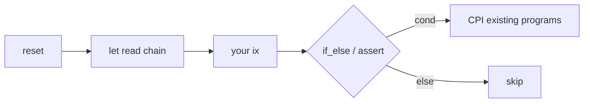

<p align="center">
  <a href="https://github.com/ifx-run/ifx"></a>
</p>

# Ifx

English | [中文](./README.zh-CN.md)

[](./LICENSE)
[](https://www.npmjs.com/package/@ifx-run/sdk)
[](./go-sdk/)
[](https://crates.io/crates/ifx-sdk)
[](https://solscan.io/account/ifxmwWVVZDmXN2DUVf7wtJYCXTRY4QsL5rzmNkXzxbj)
[](https://solscan.io/account/ifxdR1RBRCsyXy7eRXGMxc2KEYWhoHSYvpP18yJ5vTc?cluster=devnet)
[](https://github.com/ifx-run/ifx)

**Ifx is one reusable on-chain orchestration program for Solana** — so you do not deploy a new custom program every time a tiny feature needs reads and branching in the middle of one transaction.

Not a VM or scripting engine — a fixed, enumerable instruction set on-chain; layout and IR off-chain.

## Networks & SDKs

| Cluster | Program ID | Notes |
|---------|------------|--------|
| **Localnet** (repo build, `npm test`) | `ifxLDKXy8Z5Hk4C9rDTnMStFXzRmpGQkGUCHfYWv5zD` | Keypair in [`keys/localnet-program-keypair.json`](./keys/localnet-program-keypair.json) |
| **Mainnet** (SDK default) | `ifxmwWVVZDmXN2DUVf7wtJYCXTRY4QsL5rzmNkXzxbj` | [Solscan](https://solscan.io/account/ifxmwWVVZDmXN2DUVf7wtJYCXTRY4QsL5rzmNkXzxbj) · [mainnet verification](./docs/mainnet-verification.md) |
| **Devnet** (experimental) | `ifxdR1RBRCsyXy7eRXGMxc2KEYWhoHSYvpP18yJ5vTc` | [Solscan](https://solscan.io/account/ifxdR1RBRCsyXy7eRXGMxc2KEYWhoHSYvpP18yJ5vTc?cluster=devnet) · **test assets only** |

| | |
| --- | --- |
| **Status** | [Devnet](#networks--sdks) + **[mainnet](#networks--sdks)** deployed (`ifxmwW…`); **no third-party audit**; [latest internal assessment](./audits/internal/2026-06-13-8a42766-ifx-internal-review.md) (2026-06-13, `8a42766`) |
| **npm** | [`@ifx-run/sdk`](./sdk/) **`0.1.0`** — `DEFAULT_IFX_PROGRAM_ID` = mainnet |
| **Go** | [`go-sdk/`](./go-sdk/) **`v0.1.0`** · `go get github.com/ifx-run/ifx/go-sdk@v0.1.0` |
| **Rust** | [`rust-sdk/`](./rust-sdk/) **`ifx-sdk@0.1.0`** · `cargo add ifx-sdk` |
| **Cursor / AI agents** | [ifx-orchestration skill](./.cursor/skills/ifx-orchestration/SKILL.md) |

```bash
npm install @ifx-run/sdk @anchor-lang/core @solana/web3.js bn.js
go get github.com/ifx-run/ifx/go-sdk@v0.1.0
cargo add ifx-sdk
```

Or clone this repo: `cd sdk && npm run build` (TS) · `npm run go:test` / `npm run rust:test` (Go/Rust; Surfpool).

---

## What Ifx is (and is not)

A Solana transaction is an **ordered instruction list**. The runtime has no if/else and **no way to hand one instruction’s result to the next** — intermediate state lives in accounts you read later, not inline values between steps.

When you need state checks, conditional branches, or arithmetic mid-flow, the usual options are:

1. **A wrapper program per flow** — small glue, repeated deploy / audit / upgrade cost.
2. **Client-only tx assembly** — snapshot chain state via RPC before sign, build instructions from assumptions that held *at query time*. Assumptions can break before landing; worse, **later instructions in the same tx still cannot branch on what earlier ones actually did** — only hard-coded unconditional paths. Classic failure: after a swap you want to close an ATA for rent; you assumed balance 0 off-chain and emitted unconditional `closeAccount`; on-chain balance ≠ 0 → **the whole tx reverts**, swap included. That is **TOCTOU** (time-of-check to time-of-use): check off-chain, act on-chain without re-reading at the moment of use.

**Ifx is a third path:** one **reusable on-chain orchestration program**. Plan the dataflow off-chain with the [TypeScript SDK](./sdk/), [Go SDK](./go-sdk/), or [Rust SDK](./rust-sdk/) (what to read, what to compute, when to CPI vs **Skip**). While the transaction executes, Ifx runs a fixed, enumerable instruction set in the same tx — **`ifx_let` reads on-chain state → math / `ifx_assert` → `ifx_if_else` conditional CPI or Skip** — over System, SPL, DEX, and other programs you already use. **No new wrapper per glue pattern**; **checks and branches run at execution time inside the tx**, closing the TOCTOU gap that RPC snapshots and unconditional ix lists create.

| | **Ifx** | Client-only tx assembly |
|---|---------|-------------------------|
| Pass values / branch between ix | **On-chain** `ifx_let` + `ifx_if_else` on mid-tx state | No; off-chain assumptions + unconditional ix only |
| Where `if / else` runs | **On-chain** during tx execution | Off-chain when you build/sign |
| Read balance **after** an earlier ix in the same tx | `ifx_let` sees post-ix state | Not at sign time; cannot Skip later ix from actual result |
| Optional `closeAccount` when balance may be ≠ 0 | **`ifx_if_else` → Skip** arm; tx continues | Unconditional close **reverts the whole tx** |

**Ifx is not** a TypeScript “instruction pipeline,” middleware, or tx composer that only runs off-chain. **TypeScript / Go / Rust SDKs** encode the dataflow; the **Ifx program** executes branches and CPIs on-chain.

### TOCTOU (time-of-check to time-of-use)

**TOCTOU** is the classic race where a **check** (RPC query, simulation, or off-chain planner assumption) and the **use** (CPI / transfer / close that lands on-chain) are not atomic. On Solana this shows up in two common forms:

1. **Sign-time vs landing-time** — between your RPC read or simulation and when your transaction executes in a slot, other transactions may land in earlier slots and change account state; you signed instructions built for stale facts.
2. **Same-tx, no re-read** — you checked balance off-chain, then emitted unconditional `closeAccount` after a swap; the swap ix ran first on-chain, but nothing re-read balance before close → revert.

**Ifx addresses TOCTOU inside one business transaction:** `ifx_let` loads account fields **during execution** (after earlier ix in that tx), `ifx_assert` guards invariants, and `ifx_if_else` picks CPI vs **Skip** from that live snapshot — not from a guess made at sign time. Ifx is **not** a separate vulnerability class; it is the mechanism that lets you **check and use in the same atomic tx**.

**Out of scope:** races across **separate landed transactions** still need bundle ordering, `ixReset` discipline, or private Frames — see [frame-authority.md](./docs/frame-authority.md) and [bundles.md](./docs/bundles.md).

### Typical flows

These are **real shapes** of Solana backend work: read → compute → branch → CPI **inside one tx**. The left column is what teams **often resort to without mid-tx orchestration** — a dedicated wrapper program, or client-built unconditional instructions from RPC snapshots:

| Typical need | Without Ifx, teams often… | Ifx |
|--------------|----------------------------|-----|
| **Empty ATA** — close and reclaim rent when balance is 0, skip otherwise (same tx as swap) | Ship a conditional-close **wrapper program** | `ifx_let` + `ifx_if_else` (CloseAccount or **Skip**) — see [example below](#example-close-an-empty-ata-without-failing-the-tx) |
| Compare lamports **before vs after** a swap in the same tx | A dedicated **orchestration wrapper**, or split across txs | `ifx_let` snapshot → your ix → `ifx_let` again → `expr` |
| “Only transfer if delta covers fees” | New **wrapper** with conditional logic | `ifx_assert` + structured / patched CPI |
| Transfer amount **unknown until mid-tx** | **Wrapper program** reads on-chain then CPIs; or split across txs | Patch CPI `data` from Frame tape (structured or raw) |
| **Dust Token-2022 ATA** — burn, harvest withheld, close | Dedicated **wrapper**, or client-only unconditional assembly | `ifx_let` + `ifx_if_else` + structured / static CPI ([example](./sdk/examples/dust-destroy-token2022.ts)) |

Ifx does **not** replace your DEX or token programs. It is the glue: read → compute → assert → CPI existing programs when the outcome depends on **chain state inside this tx**.

### Example: close an empty ATA without failing the tx

**Goal:** in the same tx as swap / settle — **if token balance is 0 → `closeAccount` and reclaim rent; else do nothing** — without reverting when the ATA still holds tokens.

```text
… your swap / settle ix …
→ ifx_reset → ifx_let(amount ← splTokenAmount(ata))
           → ifx_if_else(amount == 0, CloseAccount CPI, Skip)
```

No separate “conditional-close helper program.” The branch runs in **Ifx**; `CloseAccount` is a CPI to SPL Token.

Extended variant (burn + harvest + close for dust): [L1 dust destroy](./sdk/examples/dust-destroy-token2022.ts) · test [`tests/dust_destroy_token2022.ts`](./tests/dust_destroy_token2022.ts).

---

## Try it in 5 minutes

**Two transactions:** provision a Frame PDA once, then run business logic in a later tx. Each business tx starts with `reset` (clears scratch tape).

```ts
import { randomBytes } from "crypto";
import { Transaction } from "@solana/web3.js";
import { expr, FrameScratch, DEFAULT_TAPE_LEN } from "@ifx-run/sdk";

// Tx 1 — once per frame_id (standalone provisioning tx)
const tapeLen = DEFAULT_TAPE_LEN;
const frameId = randomBytes(32); // persist for later jobs
const { scratch, ixCreate } = FrameScratch.planPublicFrame({
  payer,
  frameId,
  tapeLen,
});
await provider.sendAndConfirm(new Transaction().add(ixCreate));

// Tx 2 — business tx (reuse scratch in the same process; another job rebuilds
// from persisted frameId — see sdk/examples/minimal-frame.ts)
const tx = new Transaction();
tx.add(scratch.ixReset());
const one = scratch.letConstU64(1);
tx.add(scratch.ixLet(one));
tx.add(scratch.ixAssert(expr.nonZero(one)));
await provider.sendAndConfirm(tx);
```

**Run on localnet** (clone this repo):

```bash
git clone https://github.com/ifx-run/ifx.git && cd ifx
npm install && npm test          # builds program + SDK, runs integration tests
# or, with validator already up:
export ANCHOR_PROVIDER_URL=http://127.0.0.1:8899
export ANCHOR_WALLET=~/.config/solana/id.json
npx ts-node -r tsconfig-paths/register sdk/examples/minimal-frame.ts
```

Examples: [`sdk/examples/`](./sdk/examples/) · [`go-sdk/examples/`](./go-sdk/examples/) · [`rust-sdk/examples/`](./rust-sdk/examples/) · [client SDK index](./docs/client-sdks.md)

### Try on mainnet (SDK default)

Point your provider at mainnet — omitted `programId` uses `DEFAULT_IFX_PROGRAM_ID` (= `IFX_MAINNET_PROGRAM_ID`):

```ts
import { FrameScratch, DEFAULT_TAPE_LEN } from "@ifx-run/sdk";

const { scratch, ixCreate } = FrameScratch.planPublicFrame({
  payer,
  frameId,
  tapeLen: DEFAULT_TAPE_LEN,
});

// business tx — scratch.authority is the Frame PDA (no authority signer)
tx.add(scratch.ixReset());
tx.add(scratch.ixLet(one));
```

Mainnet program id: `ifxmwWVVZDmXN2DUVf7wtJYCXTRY4QsL5rzmNkXzxbj`. See [Networks & SDKs](#networks--sdks) and [docs/mainnet-verification.md](./docs/mainnet-verification.md) before production use.

### Try on devnet

Pass `IFX_DEVNET_PROGRAM_ID` explicitly (devnet experimental — test SOL / test tokens only):

```ts
import { FrameScratch, DEFAULT_TAPE_LEN, IFX_DEVNET_PROGRAM_ID } from "@ifx-run/sdk";

const { scratch, ixCreate } = FrameScratch.planPublicFrame({
  payer,
  frameId,
  tapeLen: DEFAULT_TAPE_LEN,
  programId: IFX_DEVNET_PROGRAM_ID,
});
```

Devnet program: `ifxdR1RBRCsyXy7eRXGMxc2KEYWhoHSYvpP18yJ5vTc`. Deploy details: [keys/README.md](./keys/README.md) (maintainers).

Need a **private / closeable** Frame (on-curve `authority` signs `reset`/`let`; reclaim rent via `close`)? Use `planNewFrame({ …, authority: payer })` — see [frame-authority.md](./docs/frame-authority.md).

---

## Using Cursor, Claude Code, or other AI agents

> **Recommended:** Before an agent edits swap / settlement transactions, point it at the **[ifx-orchestration skill](./.cursor/skills/ifx-orchestration/SKILL.md)**. It encodes the two-tx model, **Structured CPI** (`structuredCpi` for official System/SPL ix) vs **RawPatched** CPI (`rawCpi` + `ifx_patched_cpi`) vs static CPI, cluster `programId` (SDK default = mainnet), **when to use Jito bundles (and when not to)**, and which L0–L3 example to extend — so you get fewer wire-format mistakes and less hand-rolled `Expr`.

| | |
|---|---|
| **In this repo** | Open in Cursor — [`.cursor/skills/ifx-orchestration/`](./.cursor/skills/ifx-orchestration/) is loaded automatically |
| **In your app repo** | Copy that folder into your project’s `.cursor/skills/`, or paste the skill URL / path into the agent prompt |
| **Claude Code & others** | See [AGENTS.md](./AGENTS.md) for the same entry point |

Supporting files: [scenarios.md](./.cursor/skills/ifx-orchestration/scenarios.md) (L0–L3 + bundle router) · [anti-patterns.md](./.cursor/skills/ifx-orchestration/anti-patterns.md) (review checklist) · [docs/bundles.md](./docs/bundles.md) (Jito semantics)

---

## How Ifx fits in one tx

Ifx instructions interleave with **your** swap / ATA / settlement ix in the **same transaction**. Typical pattern:

```text
ifx_reset_frame → ifx_let → … your instructions … → ifx_assert / ifx_if_else / ifx_patched_cpi
```



- **Frame** — PDA whose `tape` is **session scratch** (default: `reset` each business tx). Not durable app state; in-bundle binding carry-over is documented in [bundles.md](./docs/bundles.md).
- **`ifx_if_else`** — each arm: **`Skip`**, **`Revert`**, or **1–254** sequential **`Cpi`** steps (static, **Structured**, and/or RawPatched). Multi-step with the same condition: `arm.cpis([...])`.
- **CPI choice** — official System / SPL / Token-2022 ix with tape-bound fields → **`structuredCpi()`** + **`structuredCpiPatch.*`** ([structured-cpi-patches.md](./docs/structured-cpi-patches.md)); DEX / custom layouts → **`rawCpi()`** + **`rawCpiPatch`** (unconditional: **`scratch.ixCpi`** → **`ifx_patched_cpi`**); fixed `data` at build time → **`staticCpi`** or **`tx.add(ix)`**.

Details: [docs/implementation.md](./docs/implementation.md) · [docs/bundles.md](./docs/bundles.md)

---

## Relationship to Lighthouse

[Lighthouse](https://www.lighthouse.voyage/) provides **runtime assertions** on mainnet (Token, Stake, Sysvar, Delta, …), used by Phantom and others as tx security guardrails. Ifx is **complementary**, not a drop-in replacement:

| | Lighthouse | Ifx |
|---|------------|-----|
| Primary goal | Tx **security asserts** (fail → revert) | Tx **orchestration** (read → compute → assert → conditional CPI / **Skip**) |
| Delta / change | Memory PDA + `AssertAccountDelta` | Two `ifx_let` + `Expr` (no Memory) |
| Skip optional steps | ❌ | ✅ `ifx_if_else` → Skip |
| Patch CPI amounts | ❌ | ✅ structured / patched CPI |

Ifx can sit **alongside** Lighthouse asserts in the same transaction. Coverage matrix and roadmap: [lighthouse-coverage.md](./docs/lighthouse-coverage.md).

Guardrail examples (no program change): [lamports delta](./sdk/examples/guardrail-lamports-delta.ts) · [token balance floor/exact](./sdk/examples/guardrail-token-balance.ts)

---

## Real scenarios

Pick the **tx template off-chain** (Token vs Token-2022, extensions, etc.). Ifx reads **values** on-chain; it does not detect account kind for you.

| Level | Example | You learn |
|-------|---------|-----------|
| **L0** | [minimal-frame.ts](./sdk/examples/minimal-frame.ts) | Frame, `reset`, `let`, `assert` |
| **L0+** | [guardrail-lamports-delta.ts](./sdk/examples/guardrail-lamports-delta.ts) · [guardrail-token-balance.ts](./sdk/examples/guardrail-token-balance.ts) | Lighthouse-style delta / absolute assert (composable, no Memory) |
| **L1** | [dust-destroy-token2022.ts](./sdk/examples/dust-destroy-token2022.ts) | `letBuilder`, structured + static CPI, chained `if_else` |
| **L2** | [two-hop-token-swap.ts](./sdk/examples/two-hop-token-swap.ts) | Two-hop A→USDC→B, read intermediate token balance, patch hop 2 |
| **L3** | [sponsored_buy.ts](./tests/sponsored_buy.ts) | Mid-tx reads, assert hard-fail, structured CPI patches |

### L1 — Destroy dust Token-2022 accounts

**Rule:** raw balance `< DUST_THRESHOLD_RAW` → burn → harvest withheld (if any) → close; **`≥` threshold** → all steps skip.

**One `ifx_let`**, **three `ifx_if_else`** (one CPI per arm). Burn uses **structured CPI** (`structuredCpiPatch.token2022BurnChecked`); harvest and close use **`staticCpi`**.

```text
let(amount, withheld, decimals)
  → if_else: dust ∧ amount > 0     → BurnChecked (structured CPI)
  → if_else: dust ∧ withheld > 0   → harvest (staticCpi)
  → if_else: dust                  → closeAccount (staticCpi)
```

Full code and `DUST_THRESHOLD_RAW` notes: **[`sdk/examples/dust-destroy-token2022.ts`](./sdk/examples/dust-destroy-token2022.ts)**

### L2 — Two-hop token swap (A → USDC → B)

**Same-tx orchestration:** hop 1 CPI credits intermediate USDC; Ifx reads **`splTokenAmount`** on that ATA; hop 2 **structured CPI** (`structuredCpiPatch.tokenTransfer`) uses the on-chain amount as exact-in.

**Out of scope in the example:** Token-2022, SOL / tx fees / WSOL — intermediate USDC ATA must exist before the business tx (balance 0 recommended).

```text
reset → CPI hop1 (A→USDC) → let(usdcOut) → structured CPI hop2 (USDC→B, amount_in ← usdcOut)
```

Full planner: **[`sdk/examples/two-hop-token-swap.ts`](./sdk/examples/two-hop-token-swap.ts)** · localnet test: [`tests/two_hop_swap.ts`](./tests/two_hop_swap.ts)

### L3 — Sponsored swap settlement

Read SOL **on-chain**, **abort if profit is too low**, repay sponsor, **buy only if SOL remains** — orchestration over existing programs, without a new dedicated orchestration program for this flow.

**ATA rent:** read the token account’s lamports **before** idempotent create (0 if missing), create the ATA, then `ataCost = lamports_after − lamports_before` on-chain. Do **not** hardcode rent — Token-2022 (extensions) and future layouts can change account size.

```ts
import { Transaction, SystemProgram } from "@solana/web3.js";
import { createAssociatedTokenAccountIdempotentInstruction } from "@solana/spl-token";
import { structuredCpi, structuredCpiPatch, expr } from "@ifx-run/sdk";

// userNAta = getAssociatedTokenAddressSync(mintN, user, …)
const tx = new Transaction();
const userMeta = { pubkey: user, isSigner: true, isWritable: true };

tx.add(scratch.ixReset());

const letBaseline = scratch.letBuilder();
const solBefore = letBaseline.lamports(userMeta);
const ataLamportsBaseline = letBaseline.lamports(userNAta); // 0 when ATA does not exist yet
tx.add(letBaseline.buildIx());

tx.add(
  createAssociatedTokenAccountIdempotentInstruction(
    sponsor, userNAta, user, mintN
  )
);

const letAta = scratch.letBuilder();
const ataLamportsAfterCreate = letAta.lamports(userNAta);
const ataCost = letAta.letEval(
  expr.sub(ataLamportsAfterCreate, ataLamportsBaseline)
);
tx.add(letAta.buildIx());

tx.add(swapIx); // ← your DEX / swap

const letAfter = scratch.letBuilder();
const solAfter = letAfter.lamports(userMeta);
const settle = letAfter.letEval(expr.add(ataCost, expr.u64(TX_FEE)));
const buyLamports = letAfter.letEval(
  expr.sub(expr.sub(solAfter, solBefore), settle)
);
tx.add(letAfter.buildIx());

tx.add(scratch.ixAssert(expr.ge(expr.sub(solAfter, solBefore), settle)));

const sponsorXfer = structuredCpi(
  SystemProgram.transfer({ fromPubkey: user, toPubkey: sponsor, lamports: 0 }),
  structuredCpiPatch.systemTransfer(settle)
).build();
tx.add(scratch.ixCpi(sponsorXfer));

tx.add(scratch.ixCpi(
  structuredCpi(
    SystemProgram.transfer({ fromPubkey: user, toPubkey: pool, lamports: 0 }),
    structuredCpiPatch.systemTransfer(buyLamports)
  ).build()
));

await provider.sendAndConfirm(tx);
```

Full test: [`tests/sponsored_buy.ts`](./tests/sponsored_buy.ts) · `if_else`: [`tests/ifx.ts`](./tests/ifx.ts)

---

## When to use Ifx

**Good fit**

- Amounts or branches depend on **on-chain reads in the same tx**
- The flow is **orchestration over existing programs**—reads, math, branches, CPI—without new persistent on-chain state
- You want wallets / simulators to see a **structured dataflow**, not opaque client assembly

**Skip Ifx**

- Every field is known when you build the tx → call System / SPL / DEX directly
- Durable application state on-chain → use your own accounts or programs; **do not** treat Frame `tape` as a state DB (default: `reset` each business tx — scratch only)

**Multi-tx splits (supported, with constraints)**

- tx2 depends on bindings tx1 wrote to Frame, and tx2 does **not** `reset` → requires a **landed Jito bundle** for in-bundle ordering and atomicity; pick the Frame model: **public** (`planPublicFrame`, off-curve `authority`, writes unchecked) vs **private** (`planNewFrame` + on-curve `authority` signs `reset`/`let`). Bundles do not guarantee landing or post-landing Frame isolation — see [docs/bundles.md](./docs/bundles.md) · [docs/frame-authority.md](./docs/frame-authority.md)

---

## Deployment

Cluster program IDs and client install commands are at the top — [Networks & SDKs](#networks--sdks).

- **`declare_id!` / committed IDL** match **localnet** (repo build). **`@ifx-run/sdk` default** is **mainnet** (`DEFAULT_IFX_PROGRAM_ID` = `IFX_MAINNET_PROGRAM_ID`). Devnet / localnet: pass `IFX_DEVNET_PROGRAM_ID` or `IFX_LOCALNET_PROGRAM_ID` explicitly.
- Integrators: pin `@ifx-run/sdk`, verify program id on your cluster, read [docs/SECURITY.md](./docs/SECURITY.md) and [docs/program-security.md](./docs/program-security.md) before production use.
- Maintainers: deploy via `npm run deploy:mainnet` / `npm run deploy:devnet` — [keys/README.md](./keys/README.md) · [docs/development.md](./docs/development.md) · [docs/mainnet-verification.md](./docs/mainnet-verification.md)

---

## Security & transparency

Ifx is **non-profit open-source** — no bug bounty, **no paid third-party firm audit**. We follow **Solana official** practices where applicable and publish what we *have* done:

| Practice | Ifx status |
|----------|------------|
| [security.txt](https://solana.com/docs/programs/verified-builds) in program binary | Embedded — report via [GitHub Security Advisories](https://github.com/ifx-run/ifx/security/advisories) |
| [Verified builds](https://solana.com/docs/programs/verified-builds) (solana-verify) | Documented for mainnet — see [docs/mainnet-verification.md](./docs/mainnet-verification.md) |
| Maintainer preflight | `npm run security:preflight` (build + keys verify + security.txt check) |
| **Internal security assessments** | [audits/](./audits/README.md) — checklist ([SECURITY-CHECKLIST.md](./audits/SECURITY-CHECKLIST.md)) aligned with [Bootcamp: Security](https://solana.com/developers/bootcamp/program-patterns/security); workflow in [AUDIT-WORKFLOW.md](./audits/AUDIT-WORKFLOW.md); Phase 0 gate: `npm run audit:phase0` |
| **Latest published review** | [2026-06-13 at `8a42766`](./audits/internal/2026-06-13-8a42766-ifx-internal-review.md) — **63 ✅ / 11 ⚠️ documented trade-offs / 0 ❌** on `programs/ifx` only; 158 npm tests incl. Structured CPI, Stake lets, and [`tests/ifx_negative.ts`](./tests/ifx_negative.ts) |

**What this is not:** internal assessments are **maintainer-led**, versioned with git, and **not a security guarantee** — they do not replace a professional audit or your own review before production.

**Full checklist:** [docs/program-security.md](./docs/program-security.md) · [audits/](./audits/README.md) · [docs/SECURITY.md](./docs/SECURITY.md)

**Verified ≠ audited.** Solscan Verified only means bytecode matches public source; it does not prove absence of bugs.

---

## Before you ship

**Mainnet / production integration**

| Topic | Guidance |
|-------|----------|
| **Frame `authority`** | **Default:** `planPublicFrame` + **`ixReset` at each atomic unit start** — covers most production flows ([frame-authority.md](./docs/frame-authority.md) §3.4). **`planNewFrame`** optional: **`close`**, pre-signed-read edge (§3.7), or defense-in-depth — not a production default. |
| **`tapeLen`** | On-chain max 65_535; SDK default **`DEFAULT_TAPE_LEN` = 512**; typical txs stay within **`RECOMMENDED_TAPE_LEN_MAX` = 8192** (larger frames = more rent + CU). |
| **`ifx_assert_multi`** | Wire max 255 conditions; **merge 3–10 guards per ix** to limit tx CU. |

- **Program ID:** npm `@ifx-run/sdk` defaults to **mainnet** (`ifxmwW…`). Repo `npm test` uses localnet explicitly. Devnet: `IFX_DEVNET_PROGRAM_ID` — [sdk/README.md](./sdk/README.md).
- **Rent:** Creating a Frame PDA costs rent (scales with `tape_len`; default cap 256 bytes). Close with `ifx_close_frame` when done.
- **Top-level `ifx_let`:** Bindings in one `ifx_let` ix must not depend on values written later in the same ix — use separate `ifx_let` calls or `letBuilder()` batches. Details: [docs/typed-let-bindings.md](./docs/typed-let-bindings.md).
- **Simulation failed?** Read Program logs as pseudocode: [docs/debugging.md](./docs/debugging.md) · error codes: [docs/errors.md](./docs/errors.md).

---

## FAQ

**Is Ifx only a tx builder / instruction pipeline?** **No.** `@ifx-run/sdk` builds transactions off-chain, but **`ifx_if_else`, `ifx_assert`, and `ifx_let` execute on-chain** during the transaction. Branching is not simulated in TypeScript—it runs in the deployed Ifx program. That is how optional `closeAccount`, dust cleanup, and “transfer only if delta ≥ fee” work in one tx.

**Do I need a separate helper program to conditional-close an ATA?** **Not for same-tx orchestration over SPL/System/DEX.** Use `ifx_let` to read the token balance, then `ifx_if_else` with a CloseAccount CPI or **Skip**. You only need a new program when you introduce **new on-chain state or protocol rules** Ifx does not cover.

**Why two transactions?** Frame creation is a one-time provisioning step (rent + PDA). Business logic runs in separate txs with `reset` at the start. You can also split logic across bundled txs — see [docs/bundles.md](./docs/bundles.md).

**Why three `if_else` for dust destroy?** Burn, harvest, and close use **different conditions** — three `if_else` in order. Re-`let` only when a later condition needs fields that a CPI changed (the dust flow reuses the first `amount` / `withheld` bindings). Same condition + multiple steps → one `arm.cpis([...])`.

**CPI choice?** Official System / SPL / Token-2022 with tape-bound fields → **`structuredCpi()`** + **`structuredCpiPatch.*`**. DEX / custom layouts → **`rawCpi()`** + **`rawCpiPatch`** (unconditional: **`scratch.ixCpi`** / **`ifx_patched_cpi`**). Fixed template `data` at build time → **`staticCpi`** + **`arm.cpi(step.staticStep)`** or direct **`tx.add(ix)`**.

**Do I need a Rust / Go client?** Off-chain: [`@ifx-run/sdk`](./sdk/README.md), **[Go SDK](./go-sdk/README.md)**, or **[Rust SDK](./rust-sdk/README.md)** (`ifx-sdk`); on-chain CPI into Ifx: [docs/rust-integration.md](./docs/rust-integration.md). Roadmap: [docs/client-sdks.md](./docs/client-sdks.md).

**Is this production-ready?** **No third-party audit** — mainnet is live (`ifxmwW…`). Read the [latest internal assessment](./audits/internal/2026-06-13-8a42766-ifx-internal-review.md) and [docs/program-security.md](./docs/program-security.md) before integrating with real funds. Pin `@ifx-run/sdk`, verify program ID on your cluster. Devnet is experimental — test assets only.

---

## Learn more

### AI agents (recommended)

Use the **[ifx-orchestration skill](./.cursor/skills/ifx-orchestration/SKILL.md)** when integrating Ifx with Cursor, Claude Code, or similar tools — see [Using Cursor, Claude Code, or other AI agents](#using-cursor-claude-code-or-other-ai-agents) above.

| Start here | |
|------------|---|
| [sdk/README.md](./sdk/README.md) | TypeScript API, `FrameScratch`, `expr`, CPI helpers |
| [go-sdk/README.md](./go-sdk/README.md) | Go API (same planner layer; no RPC / wallet wrapper) |
| [rust-sdk/README.md](./rust-sdk/README.md) | Rust API (`ifx-sdk`; same planner layer; no RPC / wallet wrapper) |
| [docs/rust-integration.md](./docs/rust-integration.md) | Rust CPI + off-chain `ifx-sdk` |
| [docs/design.md](./docs/design.md) | SSA model and motivation |
| [docs/README.md](./docs/README.md) | Full doc index |
| [audits/README.md](./audits/README.md) | Security assessments (versioned) |
| [docs/development.md](./docs/development.md) | Build, test, devnet deploy (maintainers) |

---

## Contributing

Issues and PRs welcome on [GitHub](https://github.com/ifx-run/ifx/issues). See [docs/development.md](./docs/development.md) for build and test setup.

---

## License

[Apache License 2.0](./LICENSE)
