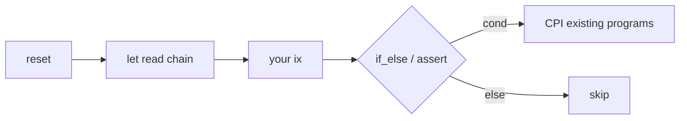

<p align="center">
  <a href="https://github.com/ifx-run/ifx"></a>
</p>

# Ifx

English | [中文](./README.zh-CN.md)

[](./LICENSE)
[](https://www.npmjs.com/package/@ifx-run/sdk/v/devnet)
[](./go-sdk/)
[](https://solscan.io/account/ifxdR1RBRCsyXy7eRXGMxc2KEYWhoHSYvpP18yJ5vTc?cluster=devnet)
[](https://github.com/ifx-run/ifx)

**Ifx is one reusable on-chain orchestration program for Solana** — so you do not deploy a new custom program every time a tiny feature needs reads and branching in the middle of one transaction.

Solana runs instructions in order; there is no built-in if/else. The product ask is often tiny (for example: after a swap, read an ATA balance, close it if zero, otherwise skip), but **reads and branches mid-transaction must run on-chain**, so teams still ship a **dedicated wrapper program** for that glue logic. **Ifx** is the reusable alternative: plan the flow with the [TypeScript SDK](./sdk/) or [Go SDK](./go-sdk/); the deployed program performs reads, math, asserts, and **`ifx_if_else` conditional CPI** (or **Skip**) while the transaction executes.

Not a VM or scripting engine — a fixed, enumerable instruction set on-chain; layout and IR off-chain.

## What Ifx is (and is not)

Solana transactions are **ordered instruction lists** with no native if/else. That glue lives **on-chain** — either a **dedicated wrapper program per flow**, or **one reusable orchestration program** (Ifx) you compose over programs you already use (System, SPL, DEX).

| | **Ifx** | Client-only tx assembly |
|---|---------|-------------------------|
| Where `if / else` runs | **On-chain** during tx execution | Off-chain when you build/sign |
| Read balance **after** an earlier ix in the same tx | `ifx_let` sees post-ix state | Not available at sign time |
| Optional `closeAccount` when balance may be ≠ 0 | **`ifx_if_else` → Skip** arm; tx continues | Unconditional close **reverts the whole tx** |

**Ifx is not** a TypeScript “instruction pipeline,” middleware, or tx composer that only runs off-chain. **TypeScript / Go SDKs** encode the dataflow; the **Ifx program** executes branches and CPIs on-chain.

### Example: close an empty ATA without failing the tx

**Goal:** in the same tx as swap / settle — **if token balance is 0 → `closeAccount` and reclaim rent; else do nothing** — without reverting when the ATA still holds tokens.

```text
… your swap / settle ix …
→ ifx_reset → ifx_let(amount ← splTokenAmount(ata))
           → ifx_if_else(amount == 0, CloseAccount CPI, Skip)
```

No separate “conditional-close helper program.” The branch runs in **Ifx**; `CloseAccount` is a CPI to SPL Token.

Extended variant (burn + harvest + close for dust): [L1 dust destroy](./sdk/examples/dust-destroy-token2022.ts) · test [`tests/dust_destroy_token2022.ts`](./tests/dust_destroy_token2022.ts).

| Key | Value |
| --- | --- |
| **Status** | **Developer preview** — localnet-tested, [devnet deployed](#deployment); **no third-party audit**; [maintainer-led internal assessment](./audits/internal/2026-06-09-11be96e-ifx-internal-review.md) (2026-06-09, commit `11be96e`); **not on mainnet** |
| **npm** | [`@ifx-run/sdk`](./sdk/) `0.3.0-devnet.0` |
| **Go** | [`go-sdk/`](./go-sdk/) — `go get github.com/ifx-run/ifx/go-sdk` ([README](./go-sdk/README.md)) |
| **Cursor / AI agents** | **[ifx-orchestration skill](./.cursor/skills/ifx-orchestration/SKILL.md)** — recommended before AI writes tx code |
| **Program (localnet / repo default)** | `ifxLDKXy8Z5Hk4C9rDTnMStFXzRmpGQkGUCHfYWv5zD` |
| **Program (devnet)** | `ifxdR1RBRCsyXy7eRXGMxc2KEYWhoHSYvpP18yJ5vTc` — [Solscan](https://solscan.io/account/ifxdR1RBRCsyXy7eRXGMxc2KEYWhoHSYvpP18yJ5vTc?cluster=devnet) |

```bash
npm install @ifx-run/sdk @anchor-lang/core @solana/web3.js bn.js
```

Go ([`solana-go`](https://github.com/gagliardetto/solana-go)):

```bash
go get github.com/ifx-run/ifx/go-sdk
```

Or clone this repo and `cd sdk && npm run build` (TS) / `npm run go:test` (Go integration tests; Surfpool required).

---

## Sound familiar?

If you build Solana backends, many flows need **orchestration inside one transaction**—snapshots, arithmetic, branches, then CPI to programs you already use. Common approaches:

- **New program** — new on-chain state or protocol rules  
- **Client-only tx assembly** — fast to iterate; harder for wallets and risk tools to verify  
- **Ifx** — generic on-chain layer; structured instruction IR; one deployed program reused across flows

| You need… | Common approaches | With Ifx |
|-----------|-------------------|----------|
| **Empty ATA** — close and reclaim rent when balance is 0, skip otherwise (same tx as swap) | Custom conditional-close wrapper program | `ifx_let` + `ifx_if_else` (CloseAccount or **Skip**) — see [example above](#example-close-an-empty-ata-without-failing-the-tx) |
| Compare lamports **before vs after** a swap in the same tx | Dedicated orchestration program, or split across txs | `ifx_let` snapshot → your ix → `ifx_let` again → `expr` |
| “Only transfer if delta covers fees” | New program with conditional logic | `ifx_assert` + `ifx_patched_cpi` |
| Transfer amount **unknown until mid-tx** | Client-side CPI patching, or a new program | Patch CPI `data` from Frame tape |
| **Dust Token-2022 ATA** — burn, harvest withheld, close | Dedicated program, or client-only assembly | `ifx_let` + `ifx_if_else` + patched / static CPI ([example](./sdk/examples/dust-destroy-token2022.ts)) |
| Wallet / risk asks “what is this tx computing?” | Logic spread across client assembly | Instruction args = inspectable dataflow IR |

Ifx does **not** replace your DEX or token programs. It is the glue: read → compute → assert → CPI existing programs when the outcome depends on **chain state inside this tx**.

---

## Try it in 5 minutes

**Two transactions:** provision a Frame PDA once, then run business logic in a later tx. Each business tx starts with `reset` (clears scratch tape).

```ts
import { randomBytes } from "crypto";
import { Transaction } from "@solana/web3.js";
import { expr, framePda, FrameScratch } from "@ifx-run/sdk";

// Tx 1 — once per frame_id (standalone provisioning tx)
const tapeLen = 256;
const frameId = randomBytes(32); // persist for later jobs
const { ixCreate } = FrameScratch.planNewFrame({
  payer,
  frameId,
  authority: payer,
  tapeLen,
});
await provider.sendAndConfirm(new Transaction().add(ixCreate));

// Tx 2 — business tx (rebuild planner from stored frameId)
const [frame] = framePda(payer, frameId);
const scratch = new FrameScratch(frame, tapeLen, 0, 0, undefined, payer);
const tx = new Transaction();

tx.add(scratch.ixReset());
const one = scratch.letConstU64(1);
tx.add(scratch.ixLet(one));
tx.add(scratch.ixAssert(expr.nonZero(one)));

await provider.sendAndConfirm(tx);
```

**Run on localnet** (clone this repo):

```bash
git clone https://github.com/ifx-run/ifx.git && cd ifx
npm install && npm test          # builds program + SDK, runs integration tests
# or, with validator already up:
export ANCHOR_PROVIDER_URL=http://127.0.0.1:8899
export ANCHOR_WALLET=~/.config/solana/id.json
npx ts-node -r tsconfig-paths/register sdk/examples/minimal-frame.ts
```

Examples: [`sdk/examples/`](./sdk/examples/) · [`go-sdk/examples/`](./go-sdk/examples/) · [Go SDK docs](./go-sdk/README.md)

### Try on devnet

Point your provider at devnet — omitted `programId` uses `DEFAULT_IFX_PROGRAM_ID` (devnet):

```ts
import { FrameScratch } from "@ifx-run/sdk";

const { scratch, ixCreate } = FrameScratch.planNewFrame({
  payer,
  frameId,
  authority: payer,
  tapeLen: 256,
});

// business tx
tx.add(scratch.ixReset());
tx.add(scratch.ixLet(one));
```

Devnet program: `ifxdR1RBRCsyXy7eRXGMxc2KEYWhoHSYvpP18yJ5vTc`. Use test SOL / test tokens only — see [keys/README.md](./keys/README.md) for deploy details (maintainers).

---

## Using Cursor, Claude Code, or other AI agents

> **Recommended:** Before an agent edits swap / settlement transactions, point it at the **[ifx-orchestration skill](./.cursor/skills/ifx-orchestration/SKILL.md)**. It encodes the two-tx model, **Structured CPI** (`structuredCpi` for official System/SPL ix) vs **RawPatched** CPI (`rawCpi` + `ifx_patched_cpi`) vs static CPI, devnet `programId`, **when to use Jito bundles (and when not to)**, and which L0–L3 example to extend — so you get fewer wire-format mistakes and less hand-rolled `Expr`.

| | |
|---|---|
| **In this repo** | Open in Cursor — [`.cursor/skills/ifx-orchestration/`](./.cursor/skills/ifx-orchestration/) is loaded automatically |
| **In your app repo** | Copy that folder into your project’s `.cursor/skills/`, or paste the skill URL / path into the agent prompt |
| **Claude Code & others** | See [AGENTS.md](./AGENTS.md) for the same entry point |

Supporting files: [scenarios.md](./.cursor/skills/ifx-orchestration/scenarios.md) (L0–L3 + bundle router) · [anti-patterns.md](./.cursor/skills/ifx-orchestration/anti-patterns.md) (review checklist) · [docs/bundles.md](./docs/bundles.md) (Jito semantics)

---

## How Ifx fits in one tx

Ifx instructions interleave with **your** swap / ATA / settlement ix in the **same transaction**. Typical pattern:

```text
ifx_reset_frame → ifx_let → … your instructions … → ifx_assert / ifx_if_else / ifx_patched_cpi
```



- **Frame** — PDA whose `tape` is **scratch paper for this tx** (`reset` clears session). Not trusted cross-tx app state.
- **`ifx_if_else`** — each arm: **`Skip`**, **`Revert`**, or **1–254** sequential **`Cpi`** steps (static, **Structured**, and/or RawPatched). Multi-step with the same condition: `arm.cpis([...])`.
- **CPI choice** — official System / SPL / Token-2022 ix with tape-bound fields → **`structuredCpi()`** + **`structuredCpiPatch.*`** ([structured-cpi-patches.md](./docs/structured-cpi-patches.md)); DEX / custom layouts → **`rawCpi()`** + **`rawCpiPatch`** (unconditional: **`scratch.ixCpi`** → **`ifx_patched_cpi`**); fixed `data` at build time → **`staticCpi`** or **`tx.add(ix)`**.

Details: [docs/implementation.md](./docs/implementation.md) · [docs/bundles.md](./docs/bundles.md)

---

## Real scenarios

Pick the **tx template off-chain** (Token vs Token-2022, extensions, etc.). Ifx reads **values** on-chain; it does not detect account kind for you.

| Level | Example | You learn |
|-------|---------|-----------|
| **L0** | [minimal-frame.ts](./sdk/examples/minimal-frame.ts) | Frame, `reset`, `let`, `assert` |
| **L1** | [dust-destroy-token2022.ts](./sdk/examples/dust-destroy-token2022.ts) | `letBuilder`, patched + static CPI (`rawCpi` / `staticCpi`), chained `if_else` |
| **L2** | [two-hop-token-swap.ts](./sdk/examples/two-hop-token-swap.ts) | Two-hop A→USDC→B, read intermediate token balance, patch hop 2 |
| **L3** | [sponsored_buy.ts](./tests/sponsored_buy.ts) | Mid-tx reads, assert hard-fail, multiple patches |

### L1 — Destroy dust Token-2022 accounts

**Rule:** raw balance `< DUST_THRESHOLD_RAW` → burn → harvest withheld (if any) → close; **`≥` threshold** → all steps skip.

**One `ifx_let`**, **three `ifx_if_else`** (one CPI per arm). Burn uses **patched CPI** (`rawCpi` + `rawCpiPatch` for `amount` + mint `decimals`); harvest and close use **`staticCpi`**.

```text
let(amount, withheld, decimals)
  → if_else: dust ∧ amount > 0     → BurnChecked (patched CPI)
  → if_else: dust ∧ withheld > 0   → harvest (staticCpi)
  → if_else: dust                  → closeAccount (staticCpi)
```

Full code, SPL byte offsets, and `DUST_THRESHOLD_RAW` notes: **[`sdk/examples/dust-destroy-token2022.ts`](./sdk/examples/dust-destroy-token2022.ts)**

### L2 — Two-hop token swap (A → USDC → B)

**Same-tx orchestration:** hop 1 CPI credits intermediate USDC; Ifx reads **`splTokenAmount`** on that ATA; hop 2 **patched CPI** (`rawCpi` + `rawCpiPatch`) uses the on-chain amount as exact-in.

**Out of scope in the example:** Token-2022, SOL / tx fees / WSOL — intermediate USDC ATA must exist before the business tx (balance 0 recommended).

```text
reset → CPI hop1 (A→USDC) → let(usdcOut) → patched CPI hop2 (USDC→B, amount_in ← usdcOut)
```

Full planner: **[`sdk/examples/two-hop-token-swap.ts`](./sdk/examples/two-hop-token-swap.ts)** · localnet test: [`tests/two_hop_swap.ts`](./tests/two_hop_swap.ts)

### L3 — Sponsored swap settlement

Read SOL **on-chain**, **abort if profit is too low**, repay sponsor, **buy only if SOL remains** — orchestration over existing programs, without a new dedicated orchestration program for this flow.

```ts
import { Transaction, SystemProgram } from "@solana/web3.js";
import { arm, ifElseArgs, rawCpi, rawCpiPatch, expr } from "@ifx-run/sdk";

// … frame already created; scratch rebuilt from stored frameId …
const tx = new Transaction();
const userMeta = { pubkey: user, isSigner: true, isWritable: true };

tx.add(scratch.ixReset());
const solBefore = scratch.letLamports(userMeta);
tx.add(scratch.ixLet(solBefore));

tx.add(swapIx); // ← your DEX / swap

const letAfter = scratch.letBuilder();
const solAfter = letAfter.lamports(userMeta);
const settle = letAfter.letConstU64(TX_FEE + ATA_RENT);
const buyLamports = letAfter.letEval(expr.sub(expr.sub(solAfter, solBefore), settle));
tx.add(letAfter.buildIx());

tx.add(scratch.ixAssert(expr.ge(expr.sub(solAfter, solBefore), settle)));

// System Transfer `data`: u32 discriminant @ 0, u64 lamports @ 4 (little-endian)
const sponsorXfer = 
rawCpi(
  SystemProgram.transfer({ fromPubkey: user, toPubkey: sponsor, lamports: 0 }),
  { patches: [rawCpiPatch(4, settle)] }
).build();
tx.add(scratch.ixCpi(sponsorXfer));

const poolXfer = 
rawCpi(
  SystemProgram.transfer({ fromPubkey: user, toPubkey: pool, lamports: 0 }),
  { patches: [rawCpiPatch(4, buyLamports)] }
).build();
tx.add(scratch.ixIfElse(
  ifElseArgs(expr.gt(buyLamports, expr.u64(0)), arm.cpi(poolXfer.cpi)),
  poolXfer.remaining
));

await provider.sendAndConfirm(tx);
```

Full test: [`tests/sponsored_buy.ts`](./tests/sponsored_buy.ts) · `if_else`: [`tests/ifx.ts`](./tests/ifx.ts)

---

## When to use Ifx

**Good fit**

- Amounts or branches depend on **on-chain reads in the same tx**
- The flow is **orchestration over existing programs**—reads, math, branches, CPI—without new persistent on-chain state
- You want wallets / simulators to see a **structured dataflow**, not opaque client assembly

**Skip Ifx**

- Every field is known when you build the tx → call System / SPL / DEX directly
- You need durable cross-tx state on the Frame PDA → Ifx has **no access control**; anyone who passes the account can `reset` or append

---

## Deployment

| Cluster | Program ID | Notes |
|---------|------------|--------|
| **Localnet** (repo default, `npm test`) | `ifxLDKXy8Z5Hk4C9rDTnMStFXzRmpGQkGUCHfYWv5zD` | Keypair in [`keys/localnet-program-keypair.json`](./keys/localnet-program-keypair.json) |
| **Devnet** (team preview) | `ifxdR1RBRCsyXy7eRXGMxc2KEYWhoHSYvpP18yJ5vTc` | Experimental; upgrade authority not public — **do not use for real funds** |
| **Mainnet** | — | Not deployed |

- **`declare_id!` / committed IDL** match **localnet** (repo build). **`@ifx-run/sdk` npm default** is **devnet** (`DEFAULT_IFX_PROGRAM_ID`). Local tests pass `IFX_LOCALNET_PROGRAM_ID` explicitly.
- Integrators: pin `@ifx-run/sdk`, verify program id on your cluster, read [docs/SECURITY.md](./docs/SECURITY.md) and [docs/program-security.md](./docs/program-security.md) before production use.
- Maintainers: [keys/README.md](./keys/README.md) · [docs/development.md](./docs/development.md)

---

## Security & transparency

Ifx is **non-profit open-source** — no bug bounty, **no paid third-party firm audit**. We follow **Solana official** practices where applicable and publish what we *have* done:

| Practice | Ifx status |
|----------|------------|
| [security.txt](https://solana.com/docs/programs/verified-builds) in program binary | Embedded — report via [GitHub Security Advisories](https://github.com/ifx-run/ifx/security/advisories) |
| [Verified builds](https://solana.com/docs/programs/verified-builds) (solana-verify) | Documented for mainnet — see [docs/mainnet-verification.md](./docs/mainnet-verification.md) |
| Maintainer preflight | `npm run security:preflight` (build + keys verify + security.txt check) |
| **Internal security assessments** | [audits/](./audits/README.md) — checklist ([SECURITY-CHECKLIST.md](./audits/SECURITY-CHECKLIST.md)) aligned with [Bootcamp: Security](https://solana.com/developers/bootcamp/program-patterns/security); workflow in [AUDIT-WORKFLOW.md](./audits/AUDIT-WORKFLOW.md); Phase 0 gate: `npm run audit:phase0` |
| **Latest published review** | [2026-06-09 at `11be96e`](./audits/internal/2026-06-09-11be96e-ifx-internal-review.md) — **63 ✅ / 11 ⚠️ documented trade-offs / 0 ❌** on `programs/ifx` only; 137 npm tests incl. Structured CPI + [`tests/ifx_negative.ts`](./tests/ifx_negative.ts) |

**What this is not:** internal assessments are **maintainer-led**, versioned with git, and **not a security guarantee** — they do not replace a professional audit or your own review before production.

**Full checklist:** [docs/program-security.md](./docs/program-security.md) · [audits/](./audits/README.md) · [docs/SECURITY.md](./docs/SECURITY.md)

**Verified ≠ audited.** Solscan Verified only means bytecode matches public source; it does not prove absence of bugs.

---

## Before you ship

- **Program ID:** npm `@ifx-run/sdk` defaults to devnet (`ifxdR1…`). Repo `npm test` uses localnet explicitly. Mainnet not deployed — [sdk/README.md](./sdk/README.md).
- **Rent:** Creating a Frame PDA costs rent (scales with `tape_len`; default cap 256 bytes). Close with `ifx_close_frame` when done.
- **Top-level `ifx_let`:** Bindings in one `ifx_let` ix must not depend on values written later in the same ix — use separate `ifx_let` calls or `letBuilder()` batches. Details: [docs/typed-let-bindings.md](./docs/typed-let-bindings.md).
- **Simulation failed?** Read Program logs as pseudocode: [docs/debugging.md](./docs/debugging.md) · error codes: [docs/errors.md](./docs/errors.md).

---

## FAQ

**Is Ifx only a tx builder / instruction pipeline?** **No.** `@ifx-run/sdk` builds transactions off-chain, but **`ifx_if_else`, `ifx_assert`, and `ifx_let` execute on-chain** during the transaction. Branching is not simulated in TypeScript—it runs in the deployed Ifx program. That is how optional `closeAccount`, dust cleanup, and “transfer only if delta ≥ fee” work in one tx.

**Do I need a separate helper program to conditional-close an ATA?** **Not for same-tx orchestration over SPL/System/DEX.** Use `ifx_let` to read the token balance, then `ifx_if_else` with a CloseAccount CPI or **Skip**. You only need a new program when you introduce **new on-chain state or protocol rules** Ifx does not cover.

**Why two transactions?** Frame creation is a one-time provisioning step (rent + PDA). Business logic runs in separate txs with `reset` at the start. You can also split logic across bundled txs — see [docs/bundles.md](./docs/bundles.md).

**Why three `if_else` for dust destroy?** Burn, harvest, and close use **different conditions** — three `if_else` in order. Re-`let` only when a later condition needs fields that a CPI changed (the dust flow reuses the first `amount` / `withheld` bindings). Same condition + multiple steps → one `arm.cpis([...])`.

**CPI choice?** Official System / SPL / Token-2022 with tape-bound fields → **`structuredCpi()`** + **`structuredCpiPatch.*`**. DEX / custom layouts → **`rawCpi()`** + **`rawCpiPatch`** (unconditional: **`scratch.ixCpi`** / **`ifx_patched_cpi`**). Fixed template `data` at build time → **`staticCpi`** + **`arm.cpi(step.staticStep)`** or direct **`tx.add(ix)`**.

**Do I need a Rust / Go client?** Off-chain: [`@ifx-run/sdk`](./sdk/README.md) or the **[Go SDK](./go-sdk/README.md)**; on-chain CPI: [docs/rust-integration.md](./docs/rust-integration.md). Roadmap: [docs/client-sdks.md](./docs/client-sdks.md).

**Is this production-ready?** **Developer preview** — integration-tested on localnet; a preview build is on devnet. We publish [maintainer-led internal assessments](./audits/README.md) (not a third-party audit). Read the [latest review](./audits/internal/2026-06-09-11be96e-ifx-internal-review.md) and [docs/program-security.md](./docs/program-security.md). Pin `@ifx-run/sdk@devnet`, verify program ID, and do not use devnet for real value.

---

## Learn more

### AI agents (recommended)

Use the **[ifx-orchestration skill](./.cursor/skills/ifx-orchestration/SKILL.md)** when integrating Ifx with Cursor, Claude Code, or similar tools — see [Using Cursor, Claude Code, or other AI agents](#using-cursor-claude-code-or-other-ai-agents) above.

| Start here | |
|------------|---|
| [sdk/README.md](./sdk/README.md) | TypeScript API, `FrameScratch`, `expr`, CPI helpers |
| [go-sdk/README.md](./go-sdk/README.md) | Go API (same planner layer; no RPC / wallet wrapper) |
| [docs/rust-integration.md](./docs/rust-integration.md) | Anchor / Rust CPI |
| [docs/design.md](./docs/design.md) | SSA model and motivation |
| [docs/README.md](./docs/README.md) | Full doc index |
| [audits/README.md](./audits/README.md) | Security assessments (versioned) |
| [docs/development.md](./docs/development.md) | Build, test, devnet deploy (maintainers) |

---

## Contributing

Issues and PRs welcome on [GitHub](https://github.com/ifx-run/ifx/issues). See [docs/development.md](./docs/development.md) for build and test setup.

---

## License

[Apache License 2.0](./LICENSE)
