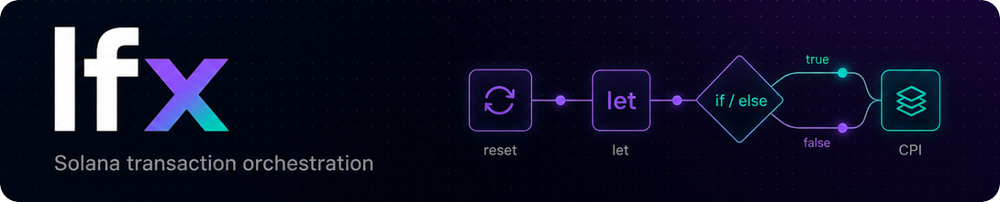
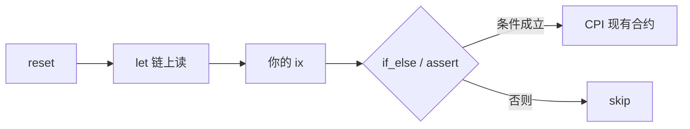

<p align="center">
  <a href="https://github.com/ifx-run/ifx"></a>
</p>

# Ifx

[English](./README.md) | 中文

[](./LICENSE)
[](https://www.npmjs.com/package/@ifx-run/sdk/v/devnet)
[](./go-sdk/)
[](https://solscan.io/account/ifxdR1RBRCsyXy7eRXGMxc2KEYWhoHSYvpP18yJ5vTc?cluster=devnet)
[](https://github.com/ifx-run/ifx)

**Ifx 是一个可复用的链上编排合约** — 解决 Solana 上「功能不大，却因为交易机制不得不单独写一个合约」的问题。

Solana 在一笔交易里按顺序执行 instruction，没有原生 if/else。业务需求往往很小（例如：swap 之后读 ATA 余额，为 0 就 close 回收租金，否则跳过），但 **交易执行到一半时的读取和分支必须在链上完成**，团队仍得为这种 glue 逻辑反复部署、维护**专用包装合约**。**Ifx** 是可复用的替代方案：链下用 [TypeScript SDK](./sdk/) 或 [Go SDK](./go-sdk/) 规划数据流；交易执行期间由合约完成读取、运算、断言和 **`ifx_if_else` 条件 CPI**（或 **Skip**）。

不是 VM，也不是脚本引擎 — 链上指令固定、可枚举；布局与 IR 在链下生成。

## Ifx 是什么（不是什么）

Solana 交易是 **按顺序执行的 instruction 列表**，没有原生 if/else。这类 glue 必须在**链上**完成 — 要么为每个流程 **单独写包装合约**，要么用 **一个可复用的编排合约**（Ifx）在已有合约（System、SPL、DEX）之上组合。

| | **Ifx** | 纯客户端组 tx |
|---|---------|---------------|
| `if / else` 在哪执行 | **链上**，tx 执行过程中 | 链下组 tx / 签名时 |
| 同一 tx 里**靠前 ix 之后**再读余额 | `ifx_let` 读到 ix 后的状态 | 签名时拿不到 |
| 余额可能 ≠ 0 时的可选 `closeAccount` | **`ifx_if_else` → Skip**，tx 继续 | 无条件 close **整笔 tx revert** |

**Ifx 不是** TypeScript 的「instruction pipeline / middleware / tx composer」，只在链下拼 ix。**TypeScript / Go SDK** 编码数据流；**Ifx 合约** 在链上执行分支与 CPI。

### 示例：余额为 0 才关 ATA，且不能让整笔 tx 失败

**目标：** 与 swap / 结算同一笔 tx — **token 余额为 0 → `closeAccount` 回收租金；否则什么都不做** — 且 ATA 里还有 token 时不能 revert。

```text
… 你的 swap / 结算 ix …
→ ifx_reset → ifx_let(amount ← splTokenAmount(ata))
           → ifx_if_else(amount == 0, CloseAccount CPI, Skip)
```

无需单独的「conditional-close 辅助合约」。分支在 **Ifx** 里执行；`CloseAccount` 是对 SPL Token 的 CPI。

更完整变体（dust：burn + harvest + close）：[L1 dust 清理](./sdk/examples/dust-destroy-token2022.ts) · 测试 [`tests/dust_destroy_token2022.ts`](./tests/dust_destroy_token2022.ts)。

| 项 | 说明 |
| --- | --- |
| **状态** | **开发者预览版** — localnet 集成测试通过，[已部署 devnet](#部署)；**无第三方付费审计**；[维护者主导的内部评估](./audits/internal/2026-06-09-11be96e-ifx-internal-review.zh-CN.md)（2026-06-09，commit `11be96e`）；**未上 mainnet** |
| **npm** | [`@ifx-run/sdk`](./sdk/) `0.3.0-devnet.0` |
| **Go** | [`go-sdk/`](./go-sdk/) — `go get github.com/ifx-run/ifx/go-sdk`（[`README`](./go-sdk/README.zh-CN.md)） |
| **Cursor / AI agent** | **[ifx-orchestration skill](./.cursor/skills/ifx-orchestration/SKILL.md)** — 建议让 AI 写 tx 前先读 |
| **Program（localnet / 仓库默认）** | `ifxLDKXy8Z5Hk4C9rDTnMStFXzRmpGQkGUCHfYWv5zD` |
| **Program（devnet）** | `ifxdR1RBRCsyXy7eRXGMxc2KEYWhoHSYvpP18yJ5vTc` — [Solscan](https://solscan.io/account/ifxdR1RBRCsyXy7eRXGMxc2KEYWhoHSYvpP18yJ5vTc?cluster=devnet) |

```bash
npm install @ifx-run/sdk @anchor-lang/core @solana/web3.js bn.js
```

Go（[`solana-go`](https://github.com/gagliardetto/solana-go)）：

```bash
go get github.com/ifx-run/ifx/go-sdk
```

或克隆本仓库后 `cd sdk && npm run build`（TS）/ `npm run go:test`（Go 集成测试，需 Surfpool）。

---

## 是不是你的日常？

做 Solana 后端时，很多需求本质是**单笔 tx 内的链上编排**——读余额、算差额、分支、再 CPI 现有合约。常见做法有三类：

- **新合约** — 新的链上状态或协议规则  
- **纯客户端组 tx** — 迭代快；钱包/风控较难验证  
- **Ifx** — 通用链上层；指令参数是可检查的数据流 IR；复用已部署合约

| 你需要… | 常见做法 | 用 Ifx |
|---------|----------|--------|
| **空 ATA** — 余额为 0 则 close 回收租金，否则跳过（与 swap 同一笔交易） | 单独写 conditional-close 包装合约 | `ifx_let` + `ifx_if_else`（CloseAccount 或 **Skip**）— 见上文示例 |
| 同一笔 tx 里对比 swap **前后** lamports | 单独编排合约，或拆成多笔 tx | `ifx_let` 快照 → 你的 ix → 再 `ifx_let` → `expr` |
| 「只有 delta 够才转账」 | 新合约写条件分支 | `ifx_assert` + `ifx_patched_cpi` |
| 转账金额要**跑完中间步骤才知道** | 客户端 patch CPI，或新合约 | 从 Frame tape patch CPI `data` |
| **Token-2022 dust ATA** — burn、harvest、close | 单独合约，或纯客户端拼装 | `ifx_let` + `ifx_if_else` + patched / static CPI（[示例](./sdk/examples/dust-destroy-token2022.ts)） |
| 钱包 / 风控问「这笔 tx 在算什么？」 | 逻辑散在客户端拼装里 | 指令参数 = 可检查的数据流 IR |

Ifx **不替代** DEX 或 token 合约。它是胶水：当结果依赖**本 tx 内的链上状态**时，读 → 算 → 断言 → CPI 现有合约。

---

## 5 分钟跑通

**两笔交易：** 先单独开通 Frame PDA，再在后续 tx 里跑业务。每笔业务 tx 开头 `reset`（清空 tape 会话）。

```ts
import { randomBytes } from "crypto";
import { Transaction } from "@solana/web3.js";
import { expr, framePda, FrameScratch } from "@ifx-run/sdk";

// Tx 1 — 每个 frame_id 一次（单独开通 tx）
const tapeLen = 256;
const frameId = randomBytes(32); // 持久化，供后续任务用
const { ixCreate } = FrameScratch.planNewFrame({
  payer,
  frameId,
  authority: payer,
  tapeLen,
});
await provider.sendAndConfirm(new Transaction().add(ixCreate));

// Tx 2 — 业务 tx（用已存的 frameId 重建 planner）
const [frame] = framePda(payer, frameId);
const scratch = new FrameScratch(frame, tapeLen, 0, 0, undefined, payer);
const tx = new Transaction();

tx.add(scratch.ixReset());
const one = scratch.letConstU64(1);
tx.add(scratch.ixLet(one));
tx.add(scratch.ixAssert(expr.nonZero(one)));

await provider.sendAndConfirm(tx);
```

**在 localnet 跑**（克隆本仓库）：

```bash
git clone https://github.com/ifx-run/ifx.git && cd ifx
npm install && npm test
export ANCHOR_PROVIDER_URL=http://127.0.0.1:8899
export ANCHOR_WALLET=~/.config/solana/id.json
npx ts-node -r tsconfig-paths/register sdk/examples/minimal-frame.ts
```

示例：[`sdk/examples/`](./sdk/examples/) · [`go-sdk/examples/`](./go-sdk/examples/) · [Go SDK 文档](./go-sdk/README.zh-CN.md)

### 在 devnet 上试

Provider 指向 devnet — 省略 `programId` 即使用 `DEFAULT_IFX_PROGRAM_ID`（devnet）：

```ts
import { FrameScratch } from "@ifx-run/sdk";

const { scratch, ixCreate } = FrameScratch.planNewFrame({
  payer,
  frameId,
  authority: payer,
  tapeLen: 256,
});

// 业务 tx
tx.add(scratch.ixReset());
tx.add(scratch.ixLet(one));
```

Devnet 合约：`ifxdR1RBRCsyXy7eRXGMxc2KEYWhoHSYvpP18yJ5vTc`。仅使用测试 SOL / 测试资产 — 部署说明见 [keys/README.zh-CN.md](./keys/README.zh-CN.md)（维护者）。

---

## 用 Cursor、Claude Code 或其他 AI agent

> **推荐：** 在让 agent 改 swap / 结算交易之前，先让它读 **[ifx-orchestration skill](./.cursor/skills/ifx-orchestration/SKILL.md)**。其中约定两笔 tx、**Structured CPI**（官方 System/SPL 用 `structuredCpi`）与 **RawPatched** CPI（`rawCpi` + `ifx_patched_cpi`）及静态 CPI 的取舍、devnet `programId`、**何时用 Jito bundle（何时不必）**，以及该从哪个 L0–L3 示例扩展，减少手写 wire format 和 `Expr` 错误。

| | |
|---|---|
| **在本仓库** | 用 Cursor 打开即可 — [`.cursor/skills/ifx-orchestration/`](./.cursor/skills/ifx-orchestration/) 会自动加载 |
| **在你自己的项目** | 把该目录复制到项目的 `.cursor/skills/`，或在 prompt 里附上 skill 的路径 / 链接 |
| **Claude Code 等** | 入口见 [AGENTS.md](./AGENTS.md) |

配套：[scenarios.md](./.cursor/skills/ifx-orchestration/scenarios.md)（L0–L3 + bundle 路由）· [anti-patterns.md](./.cursor/skills/ifx-orchestration/anti-patterns.md)（审查清单）· [docs/bundles.zh-CN.md](./docs/bundles.zh-CN.md)（Jito 语义）

---

## 一笔 tx 里 Ifx 插在哪

Ifx 与你的 swap / ATA / 结算 **同一笔 tx**，常见顺序：

```text
ifx_reset_frame → ifx_let → … 你的指令 … → ifx_assert / ifx_if_else / ifx_patched_cpi
```



- **Frame** — PDA 的 `tape` 是**本 tx 草稿纸**（`reset` 清空会话），不是跨 tx 业务状态。
- **`ifx_if_else`** — 每臂：**`Skip`**、**`Revert`**，或 **1–254** 个顺序 **`Cpi`** 步（可混静态、**Structured** 与 RawPatched）。同一条件多步：`arm.cpis([...])`。
- **CPI 选型** — 官方 System / SPL / Token-2022 且字段来自 tape → **`structuredCpi()`** + **`structuredCpiPatch.*`**（[structured-cpi-patches.zh-CN.md](./docs/structured-cpi-patches.zh-CN.md)）；DEX / 自定义 layout → **`rawCpi()`** + **`rawCpiPatch`**（无条件 **`scratch.ixCpi`** → **`ifx_patched_cpi`**）；组 tx 时 `data` 已完整 → **`staticCpi`** 或 **`tx.add(ix)`**。

细节：[docs/implementation.zh-CN.md](./docs/implementation.zh-CN.md) · [docs/bundles.zh-CN.md](./docs/bundles.zh-CN.md)

---

## 真实场景

**组 tx 时选模板**（Token / Token-2022、扩展等链下已知）。Ifx 只读链上**数值**，不在链上判断账户类型。

| 级别 | 示例 | 你会学到 |
|------|------|----------|
| **L0** | [minimal-frame.ts](./sdk/examples/minimal-frame.ts) | Frame、`reset`、`let`、`assert` |
| **L1** | [dust-destroy-token2022.ts](./sdk/examples/dust-destroy-token2022.ts) | `letBuilder`、patched + static CPI（`rawCpi` / `staticCpi`）、链式 `if_else` |
| **L2** | [two-hop-token-swap.ts](./sdk/examples/two-hop-token-swap.ts) | 两跳 A→USDC→B、读中间 token 余额、patch 第二跳 |
| **L3** | [sponsored_buy.ts](./tests/sponsored_buy.ts) | tx 中途读、assert 硬失败、多处 patch |

### L1 — 销毁 dust Token-2022 账户

**规则：** 原始余额 `< DUST_THRESHOLD_RAW` → burn → harvest（如有）→ close；**≥ 阈值** → 全部 skip。

**一次 `ifx_let`**，**三次 `ifx_if_else`**（每臂一条 CPI）。burn 用 **patched CPI**（`rawCpi` + `rawCpiPatch` 读 amount + decimals）；harvest / close 用 **`staticCpi`**。

```text
let(amount, withheld, decimals)
  → if_else: dust ∧ amount > 0     → BurnChecked（patched CPI）
  → if_else: dust ∧ withheld > 0   → harvest（staticCpi）
  → if_else: dust                  → closeAccount（staticCpi）
```

完整代码、SPL 字节偏移、`DUST_THRESHOLD_RAW` 说明：**[`sdk/examples/dust-destroy-token2022.ts`](./sdk/examples/dust-destroy-token2022.ts)**

### L2 — 两跳 token swap（A → USDC → B）

**同一 tx 内编排：** 第一跳 CPI 产出中间 USDC；Ifx **`splTokenAmount`** 读该 ATA；第二跳 **patched CPI**（`rawCpi` + `rawCpiPatch`）用链上读到的数量作 exact-in。

**示例范围外：** Token-2022、SOL/手续费/WSOL — 中间 USDC ATA 须在业务 tx 前建好（建议余额从 0 开始）。

```text
reset → CPI 第一跳（A→USDC）→ let(usdcOut) → patched CPI 第二跳（USDC→B，amount_in ← usdcOut）
```

完整 planner：**[`sdk/examples/two-hop-token-swap.ts`](./sdk/examples/two-hop-token-swap.ts)** · localnet 测试：[`tests/two_hop_swap.ts`](./tests/two_hop_swap.ts)

### L3 — 赞助代付 + swap 结算

链上读 SOL，**利润不够就 revert**，还款给赞助方，**有剩余才**买入——在已有合约之上编排，无需为本流程单独 deploy 新合约。

```ts
import { Transaction, SystemProgram } from "@solana/web3.js";
import { arm, ifElseArgs, rawCpi, rawCpiPatch, expr } from "@ifx-run/sdk";

const tx = new Transaction();
const userMeta = { pubkey: user, isSigner: true, isWritable: true };

tx.add(scratch.ixReset());
const solBefore = scratch.letLamports(userMeta);
tx.add(scratch.ixLet(solBefore));

tx.add(swapIx);

const letAfter = scratch.letBuilder();
const solAfter = letAfter.lamports(userMeta);
const settle = letAfter.letConstU64(TX_FEE + ATA_RENT);
const buyLamports = letAfter.letEval(expr.sub(expr.sub(solAfter, solBefore), settle));
tx.add(letAfter.buildIx());

tx.add(scratch.ixAssert(expr.ge(expr.sub(solAfter, solBefore), settle)));

// System Transfer data：u32 discriminant @ 0，u64 lamports @ 4（小端）
const sponsorXfer = 
rawCpi(
  SystemProgram.transfer({ fromPubkey: user, toPubkey: sponsor, lamports: 0 }),
  { patches: [rawCpiPatch(4, settle)] }
).build();
tx.add(scratch.ixCpi(sponsorXfer));

const poolXfer = 
rawCpi(
  SystemProgram.transfer({ fromPubkey: user, toPubkey: pool, lamports: 0 }),
  { patches: [rawCpiPatch(4, buyLamports)] }
).build();
tx.add(scratch.ixIfElse(
  ifElseArgs(expr.gt(buyLamports, expr.u64(0)), arm.cpi(poolXfer.cpi)),
  poolXfer.remaining
));

await provider.sendAndConfirm(tx);
```

完整测试：[`tests/sponsored_buy.ts`](./tests/sponsored_buy.ts) · `if_else`：[`tests/ifx.ts`](./tests/ifx.ts)

---

## 什么时候用 Ifx

**适合**

- 金额或分支依赖**同一 tx 内的链上读取**
- 业务是**在已有合约之上的编排**——读状态、运算、分支、CPI，且不引入新的持久链上状态
- 希望 wallet / 模拟器看到**结构化数据流**

**不必用**

- 组 tx 时所有字段都已知 → 直接调 System / SPL / DEX
- 需要把 Frame PDA 当**跨 tx 业务状态** → Ifx **无权限控制**

---

## 部署

| 环境 | Program ID | 说明 |
|------|------------|------|
| **Localnet**（仓库默认，`npm test`） | `ifxLDKXy8Z5Hk4C9rDTnMStFXzRmpGQkGUCHfYWv5zD` | Keypair 见 [`keys/localnet-program-keypair.json`](./keys/localnet-program-keypair.json) |
| **Devnet**（团队预览） | `ifxdR1RBRCsyXy7eRXGMxc2KEYWhoHSYvpP18yJ5vTc` | 实验性；upgrade 权限不公开 — **勿用于真实资金** |
| **Mainnet** | — | 未部署 |

- **`declare_id!` / 仓库 IDL** 对应 **localnet**（仓库构建）。**`@ifx-run/sdk` npm 默认** 为 **devnet**（`DEFAULT_IFX_PROGRAM_ID`）。本地测试显式传 `IFX_LOCALNET_PROGRAM_ID`。
- 集成方：pin `@ifx-run/sdk`，核对目标集群合约 ID，上生产前阅读 [docs/SECURITY.zh-CN.md](./docs/SECURITY.zh-CN.md) 与 [docs/program-security.zh-CN.md](./docs/program-security.zh-CN.md)。
- 维护者：[keys/README.zh-CN.md](./keys/README.zh-CN.md) · [docs/development.zh-CN.md](./docs/development.zh-CN.md)

---

## 安全与透明

Ifx 为**非盈利开源**项目 — 无漏洞赏金，**无付费第三方 firm 审计**。在适用处对齐 **Solana 官方**实践，并公开**已完成**的工作：

| 实践 | Ifx 状态 |
|------|----------|
| 程序内 [security.txt](https://solana.com/docs/programs/verified-builds) | 已嵌入 — 通过 [GitHub Security Advisories](https://github.com/ifx-run/ifx/security/advisories) 报告 |
| [Verified builds](https://solana.com/docs/programs/verified-builds)（solana-verify） | 主网流程已文档化 — [docs/mainnet-verification.zh-CN.md](./docs/mainnet-verification.zh-CN.md) |
| 维护者预检 | `npm run security:preflight`（构建 + keys 校验 + security.txt 检查） |
| **内部安全评估** | [audits/](./audits/README.zh-CN.md) — 清单 [SECURITY-CHECKLIST.zh-CN.md](./audits/SECURITY-CHECKLIST.zh-CN.md) 对齐 [Bootcamp: Security](https://solana.com/developers/bootcamp/program-patterns/security)；流程见 [AUDIT-WORKFLOW.zh-CN.md](./audits/AUDIT-WORKFLOW.zh-CN.md)；Phase 0：`npm run audit:phase0` |
| **最新已发布审查** | [2026-06-09 @ `11be96e`](./audits/internal/2026-06-09-11be96e-ifx-internal-review.zh-CN.md) — 仅 `programs/ifx`：**63 ✅ / 11 ⚠️ 已文档化取舍 / 0 ❌**；137 个 npm 测试，含 Structured CPI 与 [`tests/ifx_negative.ts`](./tests/ifx_negative.ts) |

**这不等于什么：** 内部评估由维护者主导、与 git 版本绑定，**不构成安全担保** — 不能替代专业审计，也不能替代集成方上线前自行审查。

**完整清单：** [docs/program-security.zh-CN.md](./docs/program-security.zh-CN.md) · [audits/](./audits/README.zh-CN.md) · [docs/SECURITY.zh-CN.md](./docs/SECURITY.zh-CN.md)

**Verified ≠ 已审计。** Solscan Verified 仅表示字节码与公开源码构建一致，不证明无漏洞。

---

## 上线前须知

- **Program ID：** npm `@ifx-run/sdk` 默认 devnet（`ifxdR1…`）。仓库 `npm test` 显式使用 localnet。主网未部署 — [sdk/README.zh-CN.md](./sdk/README.zh-CN.md)。
- **Rent：** 创建 Frame 需 rent；不用时 `ifx_close_frame` 回收
- **顶层 `ifx_let`：** 同条 ix 内绑定不能前后依赖 — [docs/typed-let-bindings.zh-CN.md](./docs/typed-let-bindings.zh-CN.md)
- **Simulation 失败：** [docs/debugging.zh-CN.md](./docs/debugging.zh-CN.md) · [docs/errors.zh-CN.md](./docs/errors.zh-CN.md)

---

## 常见问题

**Ifx 只是 tx builder / instruction pipeline 吗？** **不是。** `@ifx-run/sdk` 在链下组 tx，但 **`ifx_if_else`、`ifx_assert`、`ifx_let` 在 tx 执行时于链上运行**。分支不是在 TypeScript 里「模拟」的，而是在已部署的 Ifx 合约里执行。可选 `closeAccount`、dust 清理、「差额够才转账」都靠这个机制在同一 tx 内完成。

**conditional-close ATA 还要单独写辅助合约吗？** **在 SPL/System/DEX 之上的同一 tx 编排不需要。** `ifx_let` 读 token 余额，`ifx_if_else` 选 CloseAccount CPI 或 **Skip** 即可。只有当你要引入 Ifx 不覆盖的**新链上状态或协议规则**时才需要新合约。

**为什么要两笔 tx？** 创建 Frame 是一次性开通；业务 tx 开头 `reset`。多 tx 拆分见 [docs/bundles.zh-CN.md](./docs/bundles.zh-CN.md)。

**CPI 怎么选？** 官方 System / SPL / Token-2022 且字段来自 tape → **`structuredCpi()`** + **`structuredCpiPatch.*`**。DEX / 自定义 layout → **`rawCpi()`** + **`rawCpiPatch`**（无条件 **`scratch.ixCpi`** / **`ifx_patched_cpi`**）。组 tx 时 data 已完整 → **`staticCpi`** + **`arm.cpi(step.staticStep)`** 或直接 **`tx.add(ix)`**。

**dust 为什么要三个 `if_else`？** burn / harvest / close **条件不同** → 三个 `if_else` 按序。只有 CPI 改动了后续条件依赖的字段时才再 `let`（dust 流程复用首次 `amount` / `withheld`）。同一条件多步 → 一个 `arm.cpis([...])`。

**需要 Rust / Go client 吗？** 链下可用 [`@ifx-run/sdk`](./sdk/README.zh-CN.md) 或 **[Go SDK](./go-sdk/README.zh-CN.md)**；链上 CPI 见 [docs/rust-integration.zh-CN.md](./docs/rust-integration.zh-CN.md)。多语言规划：[docs/client-sdks.zh-CN.md](./docs/client-sdks.zh-CN.md)。

**能上生产吗？** **开发者预览版** — localnet 集成测试；devnet 有预览部署。我们发布[维护者主导的内部评估](./audits/README.zh-CN.md)（**非**第三方审计）。请阅读[最新审查](./audits/internal/2026-06-09-11be96e-ifx-internal-review.zh-CN.md)与 [docs/program-security.zh-CN.md](./docs/program-security.zh-CN.md)。请 pin `@ifx-run/sdk@devnet`、核对合约 ID，勿在 devnet 使用真实资产。

---

## 延伸阅读

### AI agent（推荐）

用 Cursor、Claude Code 等工具集成 Ifx 时，请使用 **[ifx-orchestration skill](./.cursor/skills/ifx-orchestration/SKILL.md)** — 详见上文 [用 Cursor、Claude Code 或其他 AI agent](#用-cursorclaude-code-或其他-ai-agent)。

| 从这里开始 | |
|------------|---|
| [sdk/README.zh-CN.md](./sdk/README.zh-CN.md) | TypeScript API、`FrameScratch`、`expr`、CPI |
| [go-sdk/README.zh-CN.md](./go-sdk/README.zh-CN.md) | Go API（同层 planner；不包装 RPC / 钱包） |
| [docs/rust-integration.zh-CN.md](./docs/rust-integration.zh-CN.md) | Anchor / Rust CPI |
| [docs/design.zh-CN.md](./docs/design.zh-CN.md) | SSA 与设计动机 |
| [docs/README.zh-CN.md](./docs/README.zh-CN.md) | 完整文档索引 |
| [audits/README.zh-CN.md](./audits/README.zh-CN.md) | 安全评估（版本化） |
| [docs/development.zh-CN.md](./docs/development.zh-CN.md) | 构建、测试、devnet 部署（维护者） |

---

## 贡献

欢迎在 [GitHub](https://github.com/ifx-run/ifx/issues) 提 issue / PR。构建与测试见 [docs/development.zh-CN.md](./docs/development.zh-CN.md)。

---

## License

[Apache License 2.0](./LICENSE)
