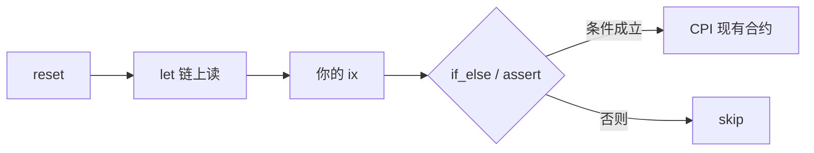

<p align="center">
  <a href="https://github.com/ifx-run/ifx"></a>
</p>

# Ifx

[English](./README.md) | 中文

[](./LICENSE)
[](https://www.npmjs.com/package/@ifx-run/sdk)
[](./go-sdk/)
[](https://crates.io/crates/ifx-sdk)
[](https://solscan.io/account/ifxmwWVVZDmXN2DUVf7wtJYCXTRY4QsL5rzmNkXzxbj)
[](https://solscan.io/account/ifxdR1RBRCsyXy7eRXGMxc2KEYWhoHSYvpP18yJ5vTc?cluster=devnet)
[](https://github.com/ifx-run/ifx)

**Ifx 是一个可复用的链上编排合约** — 解决 Solana 上「功能不大，却因为交易机制不得不单独写一个合约」的问题。

不是 VM，也不是脚本引擎 — 链上指令固定、可枚举；布局与 IR 在链下生成。

## Ifx 是什么（不是什么）

Solana 交易是一笔 **按顺序执行的 instruction 列表**。运行时没有 if/else，也 **没有机制把上一条 instruction 的执行结果交给下一条** — 中间态只能写在账户里、靠后面的 ix 再读，不能在指令之间行内传值。

要做状态检查、条件分支或数值运算，通常只有两条老路：

1. **为每个流程写一个包装合约** — 胶水逻辑往往不大，却要反复部署、审计、升级。
2. **完全在链下组 tx** — 签名前用 RPC 拉链上状态当依据，按「当时认为成立」的假设拼 instruction。问题在于：假设可能在签字与上链之间失效；更关键的是，**同一笔 tx 里靠前的 ix 执行完后，后面的 ix 仍无法根据实际结果分支**，只能写死无条件路径。典型失败：swap 之后想关 ATA 省 rent，链下假设余额为 0 却拼了无条件的 `closeAccount`，链上余额非 0 时 **整笔 tx revert**，swap 的成果一并作废。这就是 **TOCTOU**（time-of-check to time-of-use，检查与使用分离）：在链下检查，在链上执行时却不按执行时刻的状态再判一次。

**Ifx 提供第三条路：** 一个 **可复用的链上编排合约**。链下用 [TypeScript SDK](./sdk/)、[Go SDK](./go-sdk/) 或 [Rust SDK](./rust-sdk/) 描述数据流（读哪些账户、算什么、满足条件时 CPI 谁、否则 **Skip**）；**交易执行过程中**，Ifx 在同一 tx 内用固定、可枚举的指令完成 **`ifx_let` 读链上状态 → 运算 / `ifx_assert` → `ifx_if_else` 条件 CPI 或 Skip**，直接调用 System、SPL、DEX 等已有 program — **不必为每种小胶水再部署包装合约**，**检查与分支在 tx 执行时完成**，消除 RPC 快照与无条件 instruction 列表带来的 TOCTOU 窗口。

|                              | **Ifx**                        | 纯客户端组 tx                   |
|------------------------------|--------------------------------|----------------------------|
| 指令间能否传值 / 分支              | **链上** `ifx_let` 读**交易中途**状态，`ifx_if_else` 分支 | 无；只能链下假设 + 无条件 instruction |
| `if / else` 在哪执行             | **链上**，tx 执行过程中                | 链下组 tx / 签名时               |
| 同一 tx 里**靠前 ix 之后**再读余额      | `ifx_let` 读到 ix 后的状态           | 签名时拿不到；上链后也无法据此 **Skip** |
| 余额可能 ≠ 0 时的可选 `closeAccount` | **`ifx_if_else` → Skip**，tx 继续 | 无条件 close **整笔 tx revert** |

**Ifx 不是** TypeScript 的「instruction pipeline / middleware / tx composer」，只在链下拼 ix。**TypeScript / Go / Rust SDK** 编码数据流；**Ifx 合约** 在链上执行分支与 CPI。

### TOCTOU（time-of-check to time-of-use，检查与使用分离）

**TOCTOU** 指 **检查**（RPC、模拟或链下 planner 假设）与 **使用**（最终落地的 CPI / 转账 / close）不是原子操作。在 Solana 上常见两类：

1. **签名时 vs 上链时** — 从 RPC 读取/模拟到你这笔 tx 在某个 slot 实际执行之间，其他交易可能已在更早的 slot 落地并改写账户状态；你签的是基于旧快照拼出来的 instruction。
2. **同一 tx 内不重读** — 链下看过余额，swap 后仍拼无条件的 `closeAccount`；swap 已在链上执行，但 close 前没人再读余额 → 整笔 revert。

**Ifx 针对的是「单笔业务 tx 内」的 TOCTOU：** `ifx_let` 在 **执行过程中** 加载账户字段（可排在靠前 ix 之后），`ifx_assert` 守不变量，`ifx_if_else` 按该时刻快照选 CPI 或 **Skip** — 而不是签名时的猜测。Ifx **不是** 新的 TOCTOU 风险来源；它是让你在 **同一原子 tx 里完成检查再使用** 的机制。

**不覆盖：** **多笔独立落地 tx** 之间的竞态仍要靠 bundle 顺序、`ixReset` 纪律或私有 Frame — 见 [frame-authority.zh-CN.md](./docs/frame-authority.zh-CN.md) 与 [bundles.zh-CN.md](./docs/bundles.zh-CN.md)。

### 典型需求

下面这些是 Solana 后端里**真实会出现**的形态：tx 内读状态、算数、分支、再 CPI。左列是 **缺乏交易内编排能力时**，团队常被迫采用的权宜之计（单独写包装合约，或链下按 RPC 快照拼无条件 instruction）：

| 典型需求 | 没有 Ifx 时往往… | Ifx |
|---------|------------------|-----|
| **空 ATA** — 余额为 0 则 close 回收租金，否则跳过（与 swap 同一笔 tx） | 单独写**条件 close** 包装合约 | `ifx_let` + `ifx_if_else`（CloseAccount 或 **Skip**）— 见下文示例 |
| tx 内对比 swap **前后** lamports | 单独**编排包装合约**，或拆成多笔 tx | `ifx_let` 快照 → 你的 ix → 再 `ifx_let` → `expr` |
| 「只有 delta 够才转账」 | 新写带条件分支的**包装合约** | `ifx_assert` + structured / patched CPI |
| 转账金额要**跑完中间步骤才知道** | 写**包装合约**链上读状态再 CPI；或拆成多笔 tx | 从 Frame tape patch CPI `data`（structured 或 raw） |
| **Token-2022 dust ATA** — burn、harvest、close | 单独**包装合约**，或纯客户端无条件拼装 | `ifx_let` + `ifx_if_else` + structured / static CPI（[示例](./sdk/examples/dust-destroy-token2022.ts)） |

Ifx **不替代** DEX 或 token 合约。它是胶水：当结果依赖**本 tx 内的链上状态**时，读 → 算 → 断言 → CPI 现有合约。

### 示例：余额为 0 才关 ATA，且不能让整笔 tx 失败

**目标：** 与 swap / 结算同一笔 tx — **token 余额为 0 → `closeAccount` 回收租金；否则什么都不做** — 且 ATA 里还有 token 时不能 revert。

```text
… 你的 swap / 结算 ix …
→ ifx_reset → ifx_let(amount ← splTokenAmount(ata))
           → ifx_if_else(amount == 0, CloseAccount CPI, Skip)
```

无需单独的「条件 close 辅助合约」。分支在 **Ifx** 里执行；`CloseAccount` 是对 SPL Token 的 CPI。

更完整变体（dust：burn + harvest + close）：[L1 dust 清理](./sdk/examples/dust-destroy-token2022.ts) · 测试 [`tests/dust_destroy_token2022.ts`](./tests/dust_destroy_token2022.ts)。

| 项 | 说明 |
| --- | --- |
| **状态** | [已部署 devnet](#部署)、**[已部署 mainnet](#部署)**（`ifxmwW…`）；**无第三方付费审计**；[维护者主导的内部评估](./audits/internal/2026-06-13-8a42766-ifx-internal-review.zh-CN.md)（2026-06-13，commit `8a42766`） |
| **npm** | [`@ifx-run/sdk`](./sdk/) **`0.1.0`** — **`DEFAULT_IFX_PROGRAM_ID` = 主网** |
| **Go** | [`go-sdk/`](./go-sdk/) — **`v0.1.0`** · `go get github.com/ifx-run/ifx/go-sdk@v0.1.0`（[`README`](./go-sdk/README.zh-CN.md)） |
| **Rust** | [`rust-sdk/`](./rust-sdk/) — **`ifx-sdk@0.1.0`** · `cargo add ifx-sdk`（[`README`](./rust-sdk/README.zh-CN.md)） |
| **Cursor / AI agent** | **[ifx-orchestration skill](./.cursor/skills/ifx-orchestration/SKILL.md)** — 建议让 AI 写 tx 前先读 |
| **Program（localnet / 仓库构建）** | `ifxLDKXy8Z5Hk4C9rDTnMStFXzRmpGQkGUCHfYWv5zD` |
| **Program（主网 / SDK 默认）** | `ifxmwWVVZDmXN2DUVf7wtJYCXTRY4QsL5rzmNkXzxbj` — [Solscan](https://solscan.io/account/ifxmwWVVZDmXN2DUVf7wtJYCXTRY4QsL5rzmNkXzxbj) |
| **Program（devnet）** | `ifxdR1RBRCsyXy7eRXGMxc2KEYWhoHSYvpP18yJ5vTc` — [Solscan](https://solscan.io/account/ifxdR1RBRCsyXy7eRXGMxc2KEYWhoHSYvpP18yJ5vTc?cluster=devnet) |

```bash
npm install @ifx-run/sdk @anchor-lang/core @solana/web3.js bn.js
```

Go（[`solana-go`](https://github.com/gagliardetto/solana-go)）：

```bash
go get github.com/ifx-run/ifx/go-sdk@v0.1.0
```

Rust：

```bash
cargo add ifx-sdk
```

或克隆本仓库后 `cd sdk && npm run build`（TS）/ `npm run go:test` 或 `npm run rust:test`（Go/Rust 集成测试，需 Surfpool）。

---

## 5 分钟跑通

**两笔交易：** 先单独开通 Frame PDA，再在后续 tx 里跑业务。每笔业务 tx 开头 `reset`（清空 tape 会话）。

```ts
import { randomBytes } from "crypto";
import { Transaction } from "@solana/web3.js";
import { expr, FrameScratch, DEFAULT_TAPE_LEN } from "@ifx-run/sdk";

// Tx 1 — 每个 frame_id 一次（单独开通 tx）
const tapeLen = DEFAULT_TAPE_LEN;
const frameId = randomBytes(32); // 持久化，供后续任务用
const { scratch, ixCreate } = FrameScratch.planPublicFrame({
  payer,
  frameId,
  tapeLen,
});
await provider.sendAndConfirm(new Transaction().add(ixCreate));

// Tx 2 — 业务 tx（同进程复用 scratch；跨进程从 frameId 重建见 sdk/examples/minimal-frame.ts）
const tx = new Transaction();
tx.add(scratch.ixReset());
const one = scratch.letConstU64(1);
tx.add(scratch.ixLet(one));
tx.add(scratch.ixAssert(expr.nonZero(one)));
await provider.sendAndConfirm(tx);
```

**在 localnet 跑**（克隆本仓库）：

```bash
git clone https://github.com/ifx-run/ifx.git && cd ifx
npm install && npm test
export ANCHOR_PROVIDER_URL=http://127.0.0.1:8899
export ANCHOR_WALLET=~/.config/solana/id.json
npx ts-node -r tsconfig-paths/register sdk/examples/minimal-frame.ts
```

示例：[`sdk/examples/`](./sdk/examples/) · [`go-sdk/examples/`](./go-sdk/examples/) · [`rust-sdk/examples/`](./rust-sdk/examples/) · [客户端 SDK 索引](./docs/client-sdks.zh-CN.md)

### 在主网试（SDK 默认）

Provider 指向 mainnet — 省略 `programId` 即 `DEFAULT_IFX_PROGRAM_ID`（= `IFX_MAINNET_PROGRAM_ID`）：

```ts
import { FrameScratch, DEFAULT_TAPE_LEN } from "@ifx-run/sdk";

const { scratch, ixCreate } = FrameScratch.planPublicFrame({
  payer,
  frameId,
  tapeLen: DEFAULT_TAPE_LEN,
});

// 业务 tx — scratch.authority 为 Frame PDA（无需 authority 签名）
tx.add(scratch.ixReset());
tx.add(scratch.ixLet(one));
```

主网 program id：`ifxmwWVVZDmXN2DUVf7wtJYCXTRY4QsL5rzmNkXzxbj`。上生产前请确认目标集群已部署 — [docs/mainnet-verification.zh-CN.md](./docs/mainnet-verification.zh-CN.md)。

### 在 devnet 上试

显式传 `IFX_DEVNET_PROGRAM_ID`（devnet 实验环境，仅测试 SOL / 测试资产）：

```ts
import { FrameScratch, DEFAULT_TAPE_LEN, IFX_DEVNET_PROGRAM_ID } from "@ifx-run/sdk";

const { scratch, ixCreate } = FrameScratch.planPublicFrame({
  payer,
  frameId,
  tapeLen: DEFAULT_TAPE_LEN,
  programId: IFX_DEVNET_PROGRAM_ID,
});
```

Devnet 合约：`ifxdR1RBRCsyXy7eRXGMxc2KEYWhoHSYvpP18yJ5vTc`。部署说明见 [keys/README.zh-CN.md](./keys/README.zh-CN.md)（维护者）。

需要 **私有 / 可关闭** Frame（on-curve `authority` 签 reset/let，日后 `close` 回收 rent）？用 `planNewFrame({ …, authority: payer })` — 见 [frame-authority.zh-CN.md](./docs/frame-authority.zh-CN.md)。

---

## 用 Cursor、Claude Code 或其他 AI agent

> **推荐：** 在让 agent 改 swap / 结算交易之前，先让它读 **[ifx-orchestration skill](./.cursor/skills/ifx-orchestration/SKILL.md)**。其中约定两笔 tx、**Structured CPI**（官方 System/SPL 用 `structuredCpi`）与 **RawPatched** CPI（`rawCpi` + `ifx_patched_cpi`）及静态 CPI 的取舍、各集群 `programId`（SDK 默认主网）、**何时用 Jito bundle（何时不必）**，以及该从哪个 L0–L3 示例扩展，减少手写 wire format 和 `Expr` 错误。

| | |
|---|---|
| **在本仓库** | 用 Cursor 打开即可 — [`.cursor/skills/ifx-orchestration/`](./.cursor/skills/ifx-orchestration/) 会自动加载 |
| **在你自己的项目** | 把该目录复制到项目的 `.cursor/skills/`，或在 prompt 里附上 skill 的路径 / 链接 |
| **Claude Code 等** | 入口见 [AGENTS.md](./AGENTS.md) |

配套：[scenarios.md](./.cursor/skills/ifx-orchestration/scenarios.md)（L0–L3 + bundle 路由）· [anti-patterns.md](./.cursor/skills/ifx-orchestration/anti-patterns.md)（审查清单）· [docs/bundles.zh-CN.md](./docs/bundles.zh-CN.md)（Jito 语义）

---

## 一笔 tx 里 Ifx 插在哪

Ifx 与你的 swap / ATA / 结算 **同一笔 tx**，常见顺序：

```text
ifx_reset_frame → ifx_let → … 你的指令 … → ifx_assert / ifx_if_else / ifx_patched_cpi
```



- **Frame** — PDA 的 `tape` 是**会话草稿**（默认每笔业务 tx `reset`），不是持久业务状态；bundle 内可延续 binding（见 [bundles.zh-CN.md](./docs/bundles.zh-CN.md)）。
- **`ifx_if_else`** — 每臂：**`Skip`**、**`Revert`**，或 **1–254** 个顺序 **`Cpi`** 步（可混静态、**Structured** 与 RawPatched）。同一条件多步：`arm.cpis([...])`。
- **CPI 选型** — 官方 System / SPL / Token-2022 且字段来自 tape → **`structuredCpi()`** + **`structuredCpiPatch.*`**（[structured-cpi-patches.zh-CN.md](./docs/structured-cpi-patches.zh-CN.md)）；DEX / 自定义 layout → **`rawCpi()`** + **`rawCpiPatch`**（无条件 **`scratch.ixCpi`** → **`ifx_patched_cpi`**）；组 tx 时 `data` 已完整 → **`staticCpi`** 或 **`tx.add(ix)`**。

细节：[docs/implementation.zh-CN.md](./docs/implementation.zh-CN.md) · [docs/bundles.zh-CN.md](./docs/bundles.zh-CN.md)

---

## 与 Lighthouse 的关系

[Lighthouse](https://www.lighthouse.voyage/) 在 mainnet 提供 **运行时断言**（Token、Stake、Sysvar、Delta 等），被 Phantom 等钱包用于 tx 安全护栏。Ifx **不是** Lighthouse 替代品，而是 **互补**：

| | Lighthouse | Ifx |
|---|------------|-----|
| 主要目标 | Tx **安全断言**（不满足 → revert） | Tx **编排**（读 → 算 → assert → 条件 CPI / **Skip**） |
| Delta / 变化量 | Memory PDA + `AssertAccountDelta` | 两次 `ifx_let` + `Expr`（无 Memory） |
| 条件跳过步骤 | ❌ | ✅ `ifx_if_else` → Skip |
| CPI 数值 patch | ❌ | ✅ structured / patched CPI |

Ifx 可与 Lighthouse assert **并列**于同一笔 tx 的不同位置。覆盖矩阵、guardrail 示例与 roadmap：**[lighthouse-coverage.zh-CN.md](./docs/lighthouse-coverage.zh-CN.md)**。

Guardrail 示例（无 program 变更）：[lamports delta](./sdk/examples/guardrail-lamports-delta.ts) · [token balance floor/exact](./sdk/examples/guardrail-token-balance.ts)

---

## 真实场景

**组 tx 时选模板**（Token / Token-2022、扩展等链下已知）。Ifx 只读链上**数值**，不在链上判断账户类型。

| 级别 | 示例 | 你会学到 |
|------|------|----------|
| **L0** | [minimal-frame.ts](./sdk/examples/minimal-frame.ts) | Frame、`reset`、`let`、`assert` |
| **L0+** | [guardrail-lamports-delta.ts](./sdk/examples/guardrail-lamports-delta.ts) · [guardrail-token-balance.ts](./sdk/examples/guardrail-token-balance.ts) | Lighthouse 式 delta / 绝对 assert（composable，无 Memory） |
| **L1** | [dust-destroy-token2022.ts](./sdk/examples/dust-destroy-token2022.ts) | `letBuilder`、structured + static CPI、链式 `if_else` |
| **L2** | [two-hop-token-swap.ts](./sdk/examples/two-hop-token-swap.ts) | 两跳 A→USDC→B、读中间 token 余额、patch 第二跳 |
| **L3** | [sponsored_buy.ts](./tests/sponsored_buy.ts) | tx 中途读、assert 硬失败、structured CPI patch |

### L1 — 销毁 dust Token-2022 账户

**规则：** 原始余额 `< DUST_THRESHOLD_RAW` → burn → harvest（如有）→ close；**≥ 阈值** → 全部 skip。

**一次 `ifx_let`**，**三次 `ifx_if_else`**（每臂一条 CPI）。burn 用 **structured CPI**（`structuredCpiPatch.token2022BurnChecked`）；harvest / close 用 **`staticCpi`**。

```text
let(amount, withheld, decimals)
  → if_else: dust ∧ amount > 0     → BurnChecked（structured CPI）
  → if_else: dust ∧ withheld > 0   → harvest（staticCpi）
  → if_else: dust                  → closeAccount（staticCpi）
```

完整代码与 `DUST_THRESHOLD_RAW` 说明：**[`sdk/examples/dust-destroy-token2022.ts`](./sdk/examples/dust-destroy-token2022.ts)**

### L2 — 两跳 token swap（A → USDC → B）

**同一 tx 内编排：** 第一跳 CPI 产出中间 USDC；Ifx **`splTokenAmount`** 读该 ATA；第二跳 **structured CPI**（`structuredCpiPatch.tokenTransfer`）用链上读到的数量作 exact-in。

**示例范围外：** Token-2022、SOL/手续费/WSOL — 中间 USDC ATA 须在业务 tx 前建好（建议余额从 0 开始）。

```text
reset → CPI 第一跳（A→USDC）→ let(usdcOut) → structured CPI 第二跳（USDC→B，amount_in ← usdcOut）
```

完整 planner：**[`sdk/examples/two-hop-token-swap.ts`](./sdk/examples/two-hop-token-swap.ts)** · localnet 测试：[`tests/two_hop_swap.ts`](./tests/two_hop_swap.ts)

### L3 — 赞助代付 + swap 结算

链上读 SOL，**利润不够就 revert**，还款给赞助方，**有剩余才**买入——在已有合约之上编排，无需为本流程单独部署新合约。

**ATA 租金：** 幂等创建前读 token 账户 lamports 基线（未创建则为 0），创建后再读，`ataCost = 创建后 − 基线`（链上算，勿写死常量）。Token-2022 带 extension 时账户更大，租金因 mint/布局而异。

```ts
import { Transaction, SystemProgram } from "@solana/web3.js";
import { createAssociatedTokenAccountIdempotentInstruction } from "@solana/spl-token";
import { structuredCpi, structuredCpiPatch, expr } from "@ifx-run/sdk";

// userNAta = getAssociatedTokenAddressSync(mintN, user, …)
const tx = new Transaction();
const userMeta = { pubkey: user, isSigner: true, isWritable: true };

tx.add(scratch.ixReset());

const letBaseline = scratch.letBuilder();
const solBefore = letBaseline.lamports(userMeta);
const ataLamportsBaseline = letBaseline.lamports(userNAta); // ATA 未创建时为 0
tx.add(letBaseline.buildIx());

tx.add(
  createAssociatedTokenAccountIdempotentInstruction(
    sponsor, userNAta, user, mintN
  )
);

const letAta = scratch.letBuilder();
const ataLamportsAfterCreate = letAta.lamports(userNAta);
const ataCost = letAta.letEval(
  expr.sub(ataLamportsAfterCreate, ataLamportsBaseline)
);
tx.add(letAta.buildIx());

tx.add(swapIx);

const letAfter = scratch.letBuilder();
const solAfter = letAfter.lamports(userMeta);
const settle = letAfter.letEval(expr.add(ataCost, expr.u64(TX_FEE)));
const buyLamports = letAfter.letEval(
  expr.sub(expr.sub(solAfter, solBefore), settle)
);
tx.add(letAfter.buildIx());

tx.add(scratch.ixAssert(expr.ge(expr.sub(solAfter, solBefore), settle)));

const sponsorXfer = structuredCpi(
  SystemProgram.transfer({ fromPubkey: user, toPubkey: sponsor, lamports: 0 }),
  structuredCpiPatch.systemTransfer(settle)
).build();
tx.add(scratch.ixCpi(sponsorXfer));

tx.add(scratch.ixCpi(
  structuredCpi(
    SystemProgram.transfer({ fromPubkey: user, toPubkey: pool, lamports: 0 }),
    structuredCpiPatch.systemTransfer(buyLamports)
  ).build()
));

await provider.sendAndConfirm(tx);
```

完整测试：[`tests/sponsored_buy.ts`](./tests/sponsored_buy.ts) · `if_else`：[`tests/ifx.ts`](./tests/ifx.ts)

---

## 什么时候用 Ifx

**适合**

- 金额或分支依赖**同一 tx 内的链上读取**
- 业务是**在已有合约之上的编排**——读状态、运算、分支、CPI，且不引入新的持久链上状态
- 希望 wallet / 模拟器看到**结构化数据流**

**不必用**

- 组 tx 时所有字段都已知 → 直接调 System / SPL / DEX
- 长期业务状态要存在链上 → 用自有账户或合约；**不要**把 Frame `tape` 当状态库（默认每笔业务 tx `reset` 当草稿）

**跨 tx 拆笔（可以，但有前提）**

- tx2 依赖 tx1 写入 Frame 的 binding、且 tx2 **不** `reset` → 须 **已落地的 Jito bundle** 保证包内顺序与原子性；并选对 Frame 类型：**公共 Frame**（`planPublicFrame`，off-curve `authority`，写操作不验签）vs **私有 Frame**（`planNewFrame` + on-curve `authority` 签 `reset`/`let`）。bundle 不保证一定上链、也不保证落地后无人再改 Frame — 见 [docs/bundles.zh-CN.md](./docs/bundles.zh-CN.md) · [docs/frame-authority.zh-CN.md](./docs/frame-authority.zh-CN.md)

---

## 部署

| 环境 | Program ID | 说明 |
|------|------------|------|
| **Localnet**（仓库构建，`npm test`） | `ifxLDKXy8Z5Hk4C9rDTnMStFXzRmpGQkGUCHfYWv5zD` | Keypair 见 [`keys/localnet-program-keypair.json`](./keys/localnet-program-keypair.json) |
| **Mainnet**（SDK 默认） | `ifxmwWVVZDmXN2DUVf7wtJYCXTRY4QsL5rzmNkXzxbj` | [Solscan](https://solscan.io/account/ifxmwWVVZDmXN2DUVf7wtJYCXTRY4QsL5rzmNkXzxbj) · `npm run deploy:mainnet` — [docs/mainnet-verification.zh-CN.md](./docs/mainnet-verification.zh-CN.md) |
| **Devnet**（实验环境） | `ifxdR1RBRCsyXy7eRXGMxc2KEYWhoHSYvpP18yJ5vTc` | 实验性；upgrade 权限不公开 — **勿用于真实资金** |

- **`declare_id!` / 仓库 IDL** 对应 **localnet**（仓库构建）。**`@ifx-run/sdk` 默认** 为 **主网**（`DEFAULT_IFX_PROGRAM_ID` = `IFX_MAINNET_PROGRAM_ID`）。Devnet / localnet 须显式传 `IFX_DEVNET_PROGRAM_ID` 或 `IFX_LOCALNET_PROGRAM_ID`。
- 集成方：pin `@ifx-run/sdk`，核对目标集群合约 ID，上生产前阅读 [docs/SECURITY.zh-CN.md](./docs/SECURITY.zh-CN.md) 与 [docs/program-security.zh-CN.md](./docs/program-security.zh-CN.md)。
- 维护者：[keys/README.zh-CN.md](./keys/README.zh-CN.md) · [docs/development.zh-CN.md](./docs/development.zh-CN.md)

---

## 安全与透明

Ifx 为**非盈利开源**项目 — 无漏洞赏金，**无付费第三方 firm 审计**。在适用处对齐 **Solana 官方**实践，并公开**已完成**的工作：

| 实践 | Ifx 状态 |
|------|----------|
| 程序内 [security.txt](https://solana.com/docs/programs/verified-builds) | 已嵌入 — 通过 [GitHub Security Advisories](https://github.com/ifx-run/ifx/security/advisories) 报告 |
| [Verified builds](https://solana.com/docs/programs/verified-builds)（solana-verify） | 主网流程已文档化 — [docs/mainnet-verification.zh-CN.md](./docs/mainnet-verification.zh-CN.md) |
| 维护者预检 | `npm run security:preflight`（构建 + keys 校验 + security.txt 检查） |
| **内部安全评估** | [audits/](./audits/README.zh-CN.md) — 清单 [SECURITY-CHECKLIST.zh-CN.md](./audits/SECURITY-CHECKLIST.zh-CN.md) 对齐 [Bootcamp: Security](https://solana.com/developers/bootcamp/program-patterns/security)；流程见 [AUDIT-WORKFLOW.zh-CN.md](./audits/AUDIT-WORKFLOW.zh-CN.md)；Phase 0：`npm run audit:phase0` |
| **最新已发布审查** | [2026-06-13 @ `8a42766`](./audits/internal/2026-06-13-8a42766-ifx-internal-review.zh-CN.md) — 仅 `programs/ifx`：**63 ✅ / 11 ⚠️ 已文档化取舍 / 0 ❌**；158 个 npm 测试，含 Structured CPI、Stake lets 与 [`tests/ifx_negative.ts`](./tests/ifx_negative.ts) |

**这不等于什么：** 内部评估由维护者主导、与 git 版本绑定，**不构成安全担保** — 不能替代专业审计，也不能替代集成方上线前自行审查。

**完整清单：** [docs/program-security.zh-CN.md](./docs/program-security.zh-CN.md) · [audits/](./audits/README.zh-CN.md) · [docs/SECURITY.zh-CN.md](./docs/SECURITY.zh-CN.md)

**Verified ≠ 已审计。** Solscan Verified 仅表示字节码与公开源码构建一致，不证明无漏洞。

---

## 上线前须知

**主网 / 生产集成建议**

| 主题 | 建议 |
|------|------|
| **Frame `authority`** | **默认：** `planPublicFrame` + 每个原子单元开头 **`ixReset`** — 覆盖多数生产流（[frame-authority.zh-CN.md](./docs/frame-authority.zh-CN.md) §3.4）。**`planNewFrame`** 可选：需 **`close`**、§3.7 预签边角、或纵深防御 — 非生产默认。 |
| **`tapeLen`** | 链上最大 65_535；SDK 默认 **`DEFAULT_TAPE_LEN` = 512**，典型 tx 不超过 **`RECOMMENDED_TAPE_LEN_MAX` = 8192**（更大 Frame 租金与 CU 更高）。 |
| **`ifx_assert_multi`** | wire 最多 255 条；**每条 ix 建议合并 3–10 条** guard，避免整笔 tx CU 过高。 |

- **Program ID：** npm `@ifx-run/sdk` 默认 **主网**（`ifxmwW…`）。仓库 `npm test` 显式使用 localnet。Devnet：`IFX_DEVNET_PROGRAM_ID` — [sdk/README.zh-CN.md](./sdk/README.zh-CN.md)。
- **Rent：** 创建 Frame PDA 需 rent（随 `tape_len` 增长；默认上限 256 字节）。不用时 `ifx_close_frame` 回收。
- **顶层 `ifx_let`：** 同条 ix 内绑定不能前后依赖 — 拆成多条 `ifx_let` 或用 `letBuilder()` 分批。见 [docs/typed-let-bindings.zh-CN.md](./docs/typed-let-bindings.zh-CN.md)。
- **Simulation 失败：** [docs/debugging.zh-CN.md](./docs/debugging.zh-CN.md) · [docs/errors.zh-CN.md](./docs/errors.zh-CN.md)

---

## 常见问题

**Ifx 只是 tx builder / instruction pipeline 吗？** **不是。** `@ifx-run/sdk` 在链下组 tx，但 **`ifx_if_else`、`ifx_assert`、`ifx_let` 在 tx 执行时于链上运行**。分支不是在 TypeScript 里「模拟」的，而是在已部署的 Ifx 合约里执行。可选 `closeAccount`、dust 清理、「差额够才转账」都靠这个机制在同一 tx 内完成。

**条件 close ATA 还要单独写辅助合约吗？** **在 SPL/System/DEX 之上的同一 tx 编排不需要。** `ifx_let` 读 token 余额，`ifx_if_else` 选 CloseAccount CPI 或 **Skip** 即可。只有当你要引入 Ifx 不覆盖的**新链上状态或协议规则**时才需要新合约。

**为什么要两笔 tx？** 创建 Frame 是一次性开通（rent + PDA）；业务 tx 开头 `reset`。也可把逻辑拆成 bundle 内多笔 tx — 见 [docs/bundles.zh-CN.md](./docs/bundles.zh-CN.md)。

**CPI 怎么选？** 官方 System / SPL / Token-2022 且字段来自 tape → **`structuredCpi()`** + **`structuredCpiPatch.*`**。DEX / 自定义 layout → **`rawCpi()`** + **`rawCpiPatch`**（无条件 **`scratch.ixCpi`** / **`ifx_patched_cpi`**）。组 tx 时 data 已完整 → **`staticCpi`** + **`arm.cpi(step.staticStep)`** 或直接 **`tx.add(ix)`**。

**dust 为什么要三个 `if_else`？** burn / harvest / close **条件不同** → 三个 `if_else` 按序。只有 CPI 改动了后续条件依赖的字段时才再 `let`（dust 流程复用首次 `amount` / `withheld`）。同一条件多步 → 一个 `arm.cpis([...])`。

**需要 Rust / Go client 吗？** 链下可用 [`@ifx-run/sdk`](./sdk/README.zh-CN.md)、**[Go SDK](./go-sdk/README.zh-CN.md)** 或 **[Rust SDK](./rust-sdk/README.zh-CN.md)**（`ifx-sdk`）；链上 CPI 进 Ifx 见 [docs/rust-integration.zh-CN.md](./docs/rust-integration.zh-CN.md)。多语言规划：[docs/client-sdks.zh-CN.md](./docs/client-sdks.zh-CN.md)。

**能上生产吗？** **无第三方付费审计** — 主网已部署（`ifxmwW…`）。集成真实资金前请阅读[最新内部评估](./audits/internal/2026-06-13-8a42766-ifx-internal-review.zh-CN.md)与 [docs/program-security.zh-CN.md](./docs/program-security.zh-CN.md)。请 pin `@ifx-run/sdk`、核对目标集群合约 ID。Devnet 为实验环境，勿使用真实资产。

---

## 延伸阅读

### AI agent（推荐）

用 Cursor、Claude Code 等工具集成 Ifx 时，请使用 **[ifx-orchestration skill](./.cursor/skills/ifx-orchestration/SKILL.md)** — 详见上文 [用 Cursor、Claude Code 或其他 AI agent](#用-cursorclaude-code-或其他-ai-agent)。

| 从这里开始 | |
|------------|---|
| [sdk/README.zh-CN.md](./sdk/README.zh-CN.md) | TypeScript API、`FrameScratch`、`expr`、CPI |
| [go-sdk/README.zh-CN.md](./go-sdk/README.zh-CN.md) | Go API（同层 planner；不包装 RPC / 钱包） |
| [rust-sdk/README.zh-CN.md](./rust-sdk/README.zh-CN.md) | Rust API（`ifx-sdk`；同层 planner；不包装 RPC / 钱包） |
| [docs/rust-integration.zh-CN.md](./docs/rust-integration.zh-CN.md) | Rust CPI + 链下 `ifx-sdk` |
| [docs/design.zh-CN.md](./docs/design.zh-CN.md) | SSA 与设计动机 |
| [docs/README.zh-CN.md](./docs/README.zh-CN.md) | 完整文档索引 |
| [audits/README.zh-CN.md](./audits/README.zh-CN.md) | 安全评估（版本化） |
| [docs/development.zh-CN.md](./docs/development.zh-CN.md) | 构建、测试、devnet 部署（维护者） |

---

## 贡献

欢迎在 [GitHub](https://github.com/ifx-run/ifx/issues) 提 issue / PR。构建与测试见 [docs/development.zh-CN.md](./docs/development.zh-CN.md)。

---

## License

[Apache License 2.0](./LICENSE)
