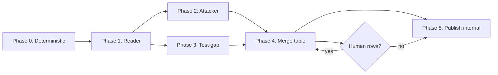

English | [中文](./AUDIT-WORKFLOW.zh-CN.md)

# Internal audit workflow — reliable reports with minimal LLM cost

Goal: **trustworthy** [internal/](./internal/) checklist reports for `programs/ifx/`, without running three full duplicate LLM audits.

**Principles**

| Principle | Why |
|-----------|-----|
| Checklist is source of truth | [SECURITY-CHECKLIST.md](./SECURITY-CHECKLIST.md) — every row has an id |
| Deterministic gates first | Tests and preflight catch regressions LLMs miss |
| Specialized agents, not clones | Reader fills; Attacker challenges; Test-gap checks proof |
| Rule-based merge | Humans (or a table) merge statuses — not a fourth LLM “summary essay” |
| Evidence or ⬜ | No `✅` without `file:line` or test name |

---

## Depth tiers

| Tier | When | Agents | Deterministic |
|------|------|--------|---------------|
| **Light** | Docs-only, no `programs/ifx` change | Skip LLM; update commit pin only if needed | — |
| **Standard** | Any material `programs/ifx` change | Reader + Attacker + Test-gap | preflight + `cargo test` |
| **Release candidate** | Tag / deploy | Standard + human sign-off on merge diff | full Section I including `npm test` |

---

## End-to-end flow



Scratch outputs live under `audits/scratch/<short-sha>/` (gitignored). See [scratch/README.md](./scratch/README.md).

---

## Phase 0 — Deterministic gate (mandatory)

From repo root on the **exact commit** under review:

```bash
npm run audit:phase0
# or manually:
git rev-parse HEAD   # record full + short SHA
npm run security:preflight
npm test
cd programs/ifx && cargo test
# optional (workspace lockfile at repo root):
cargo audit
```

`audit:phase0` creates `audits/scratch/<short-sha>/phase0.log` and `commit.txt`.

#### `cargo audit` troubleshooting

`cargo audit` fetches the [RustSec advisory-db](https://github.com/RustSec/advisory-db) over git HTTPS, then scans the workspace `Cargo.lock` at repo root. A **fetch failure is not a program vulnerability** — resolve connectivity or use a fallback before recording G05.

| Step | When |
|------|------|
| `cargo audit` | Default — refresh advisory-db and scan |
| `cargo audit --no-fetch --stale` | Git fetch failed but `~/.cargo/advisory-db` exists locally (`audit:phase0` retries with this automatically) |
| HTTP(S) proxy env vars | **Optional, environment-specific only:** if fetch fails due to network or firewall and you *already* use a local HTTP proxy, you may retry once with your usual `HTTP_PROXY` / `HTTPS_PROXY` / `ALL_PROXY` (or equivalent) pointing at **your** listener. Not all maintainers need this — do not treat a proxy as the default path. Do not commit proxy URLs or ports into the repo. |

Record the command that succeeded and any allowed RustSec warnings in the phase-0 log when G05 is in scope.

| Result | Action |
|--------|--------|
| Any command fails | Fix code first; do not mark Section I rows ✅ |
| All pass | Record in Reader template “Deterministic commands” table |

This phase is **non-negotiable** — it is what makes the report reliable regardless of LLM mood.

---

## Phase 1 — Reader agent

**Prompt:** [templates/reader-prompt.md](./templates/reader-prompt.md)  
**Output:** `audits/scratch/<short-sha>/reader.md` using [reader-report.template.md](./templates/reader-report.template.md)

Fills **all** `IFX-SEC-*` rows (BC + A–I). Marks rows without evidence as `⬜`. Lists “Rows needing follow-up” for C/D/E and any weak ✅.

**Cursor tip:** New Agent chat; paste reader prompt + commit SHA; point at `SECURITY-CHECKLIST.md` and `programs/ifx/`.

---

## Phase 2 — Attacker agent

**Prompt:** [templates/attacker-prompt.md](./templates/attacker-prompt.md)  
**Input:** Reader output + checklist + [design.md](../docs/design.md)  
**Output:** `audits/scratch/<short-sha>/attacker.md`

Reviews **only** high-risk surface (C, D, E) and Reader rows lacking evidence. Each finding gets CONFIRM-RISK / ACCEPT-TRADEOFF / NOT-EXPLOITABLE.

Does **not** rewrite the full checklist.

---

## Phase 3 — Test-gap agent

**Prompt:** [templates/test-gap-prompt.md](./templates/test-gap-prompt.md)  
**Input:** Reader output + test files  
**Output:** `audits/scratch/<short-sha>/test-gap.md`

Classifies each Reader `✅` as TESTED / CODE-ONLY / WEAK. Feeds BC03 / I06 (“invariants in tests”).

---

## Phase 4 — Merge (rules, not LLM prose)

Copy [merge-diff.template.md](./templates/merge-diff.template.md) → `audits/scratch/<short-sha>/merge-diff.md`.

Apply the **merge rules** in that template (deterministic gate → unanimous ✅ → Attacker CONFIRM-RISK → Test-gap downgrades → human escalation).

**Who merges:** Maintainer fills the table by hand, or asks an agent **only** to populate the table from the three inputs — **not** to write a new narrative report.

**Third opinion:** Only for rows with `Human? = yes`. Options:

- Read the cited Rust yourself
- Short focused agent: “Given file X and attack story Y, does Z hold?”
- Add a test and re-run Phase 0

---

## Phase 5 — Publish

1. Copy merged statuses into `internal/YYYY-MM-DD-<short-sha>-ifx-internal-review.md` (+ `.zh-CN.md`). See [internal/README.md](./internal/README.md).
2. Header: **review date** (`YYYY-MM-DD`), **full + short commit**, checklist revision, program id(s).
3. Add a row to [audits/README.md](./README.md) Reports table.
4. Delete or archive `audits/scratch/<short-sha>/` after publish.

**Publish gate**

- Zero `❌`
- No unresolved `⬜` with human escalation
- Release candidate: all Section I commands ran green

---

## What we deliberately avoid

| Anti-pattern | Replacement |
|--------------|-------------|
| 3× full checklist audits | 1× Reader + focused Attacker + Test-gap |
| LLM merges three essays into a fourth | Merge-diff table + rules |
| ✅ without citation | Evidence column; Test-gap catches CODE-ONLY |
| Auditing SDK / integrator tx | Out of scope per checklist header |

---

## Quick start (Standard tier)

```bash
SHA=$(git rev-parse --short HEAD)
mkdir -p audits/scratch/$SHA
# Phase 0 — run commands above
# Phase 1 — Agent + templates/reader-prompt.md → audits/scratch/$SHA/reader.md
# Phase 2 — Agent + templates/attacker-prompt.md → audits/scratch/$SHA/attacker.md
# Phase 3 — Agent + templates/test-gap-prompt.md → audits/scratch/$SHA/test-gap.md
# Phase 4 — Fill templates/merge-diff.template.md → audits/scratch/$SHA/merge-diff.md
# Phase 5 — Update audits/internal/…-ifx-internal-review.md
```

---

## Related

| Doc | Role |
|-----|------|
| [SECURITY-CHECKLIST.md](./SECURITY-CHECKLIST.md) | Row definitions |
| [README.md](./README.md) | Report index |
| [docs/program-security.md](../docs/program-security.md) | security.txt, verify, preflight |
| [templates/](./templates/) | Agent prompts + output shapes |
